# MiControl

> Hardware control panel for Xiaomi laptops on Windows — built with Tauri v2, React 19, and Rust.

MiControl is a native Windows desktop application that exposes the full hardware control interface of Xiaomi laptops: performance modes, battery charging thresholds, display management, fan curves, touchpad settings, ambient-light adaptive brightness, and AI-powered system analysis — all in a single, lightweight system-tray app.

---

## Table of Contents

- [Features](#features)
- [Architecture Overview](#architecture-overview)
- [IPC Command Map](#ipc-command-map)
- [Hardware Subsystems](#hardware-subsystems)
  - [Performance Mode](#-performance-mode)
  - [Battery & Charging](#-battery--charging)
  - [Display Control](#-display-control)
  - [Adaptive Brightness Sensitivity](#-adaptive-brightness-sensitivity)
  - [Fan Control](#-fan-control)
  - [Touchpad](#-touchpad)
  - [System Info](#-system-info)
  - [Hardware Discovery](#-hardware-discovery)
  - [Startup Manager](#-startup-manager)
  - [System Tray](#-system-tray)
- [AI System Advisor](#ai-system-advisor)
- [Project Structure](#project-structure)
- [Tech Stack](#tech-stack)
- [Build & Installation](#build--installation)
  - [Prerequisites](#prerequisites)
  - [Development Build](#development-build)
  - [Release Build](#release-build)
- [Driver Installation](#driver-installation)
- [Internationalization](#internationalization)
- [Testing](#testing)
- [Security](#security)
- [License](#license)

---

## Features

| Category | Feature | Implementation |
|---|---|---|
| **Performance** | 7 performance modes (Silence → Turbo → Extreme) | VHF DeviceIoControl + Registry |
| **Battery** | Level, health, cycle count, temperature, voltage, time remaining | WMI `root\wmi` |
| **Charging** | Configurable charge limit (40 / 50 / 60 / 70 / 80%) | IoTService named pipe |
| **Display** | Brightness control (0–100%) | Intel IGCL (`ControlLib.dll`) / WMI fallback |
| **Display** | HDR on/off | Intel IGCL `CtlHdrSetState` |
| **Display** | AI Adaptive Brightness toggle | Intel IGCL + Registry |
| **Display** | Adaptive brightness sensitivity (floor, ceiling, sensitivity, smoothing) | Windows Sensor API (`LightSensor`) + Tokio loop |
| **Display** | Current refresh rate readout | WMI `WmiMonitorBrightness` |
| **Fan** | Fan RPM readout | WMI `Win32_Fan` |
| **Fan** | GPU temperature | WMI `MSAcpi_ThermalZoneTemperature` |
| **Fan** | Fan mode: Auto / Fixed / Off | Registry `HKLM\SOFTWARE\MI\FanControl` |
| **Touchpad** | Sensitivity: Low / Medium / High / Max | HID output report (BLTP7853 COL04) |
| **Touchpad** | Haptic feedback toggle | HID output report + Registry |
| **System** | CPU name, cores, threads, usage % | WMI `Win32_Processor` |
| **System** | GPU name | WMI `Win32_VideoController` |
| **System** | RAM total / free | WMI `Win32_PhysicalMemory` |
| **System** | OS version | WMI `Win32_OperatingSystem` |
| **Discovery** | Auto-detect all hardware paths at startup | SetupAPI + WMI + Registry scan |
| **Discovery** | Capability flags (7 flags) gates UI features per device | `HardwareCapabilities` struct |
| **Discovery** | Touchscreen + Stylus HID path detection | HID Usage Page `0x000D` |
| **Updates** | BIOS version check | WMI `Win32_BIOS` |
| **Updates** | Xiaomi driver scan | `pnputil /enum-drivers` |
| **AI Advisor** | Hardware analysis & optimisation recommendations | OpenAI-compatible REST API (frontend `fetch`) |
| **AI Advisor** | Configurable endpoint (OpenAI, Ollama, Azure, LM Studio…) | `localStorage` key `micontrol_settings_v1` |
| **Startup** | Run at Windows startup | `HKCU\...\CurrentVersion\Run` |
| **Tray** | Minimize to system tray | Tauri tray icon |
| **Tray** | Quick-actions popup (300 px) | `TrayPopup.tsx` |
| **i18n** | All strings centralized in `en.json` | Custom `useI18n` hook |

---

## Architecture Overview

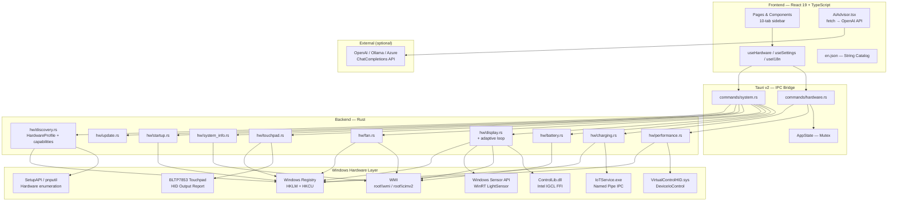

---

## IPC Command Map

All 26 Tauri commands available via `invoke()` in the frontend:

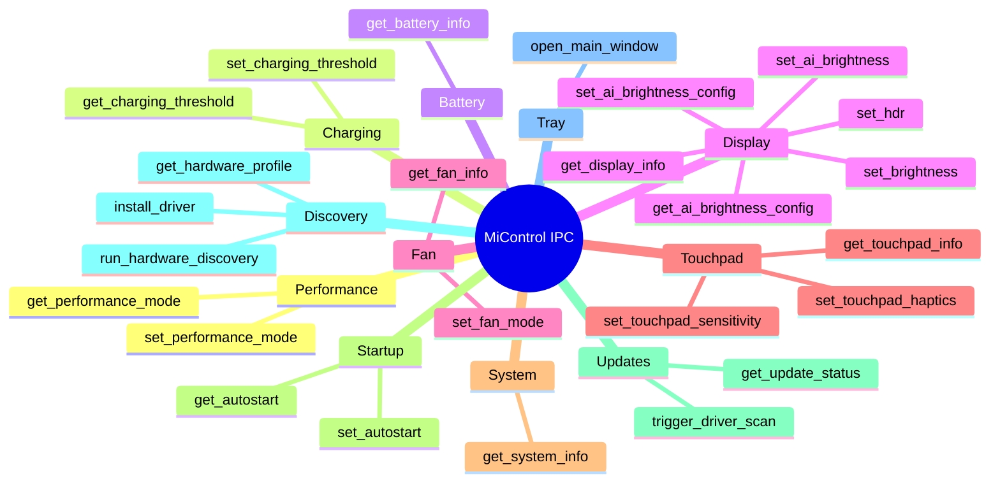

---

## Hardware Subsystems

### ⚡ Performance Mode

Controls the laptop's performance profile by sending IOCTL commands to the `VirtualControlHID.sys` kernel driver via the custom device interface GUID `{0CC99493-EB87-54F5-BB10-C0D5EA4A4F4C}`. The last mode is persisted to the Windows Registry as a fallback. The device path is cached by the hardware discovery module on startup, avoiding redundant enumeration on every call.

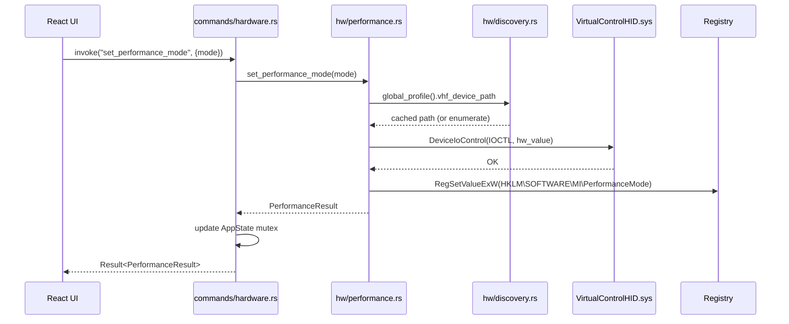

**Available modes:**

| Mode | HW Value | Description |
|---|---|---|
| `silence` | `0` | Quiet operation, fan off, reduced performance |
| `balance` | `1` | Balanced — recommended for most tasks *(default)* |
| `turbo` | `2` | Maximum performance |
| `decepticon` | `3` | Unlocked extreme mode (requires firmware unlock) |
| `smart` | `10` | Auto-adjusts based on workload |
| `long_battery` | `11` | Extended battery life, reduced performance |
| `smart_acceleration` | `14` | Temporary performance boost when needed |

---

### 🔋 Battery & Charging

Battery status is read from the WMI `root\wmi` namespace (not `root\cimv2`), which hosts the Xiaomi-specific ACPI battery classes. Charging threshold is controlled via the `IoTService` userland service through a named pipe. The pipe path is resolved from the hardware profile cache and falls back to the known default.

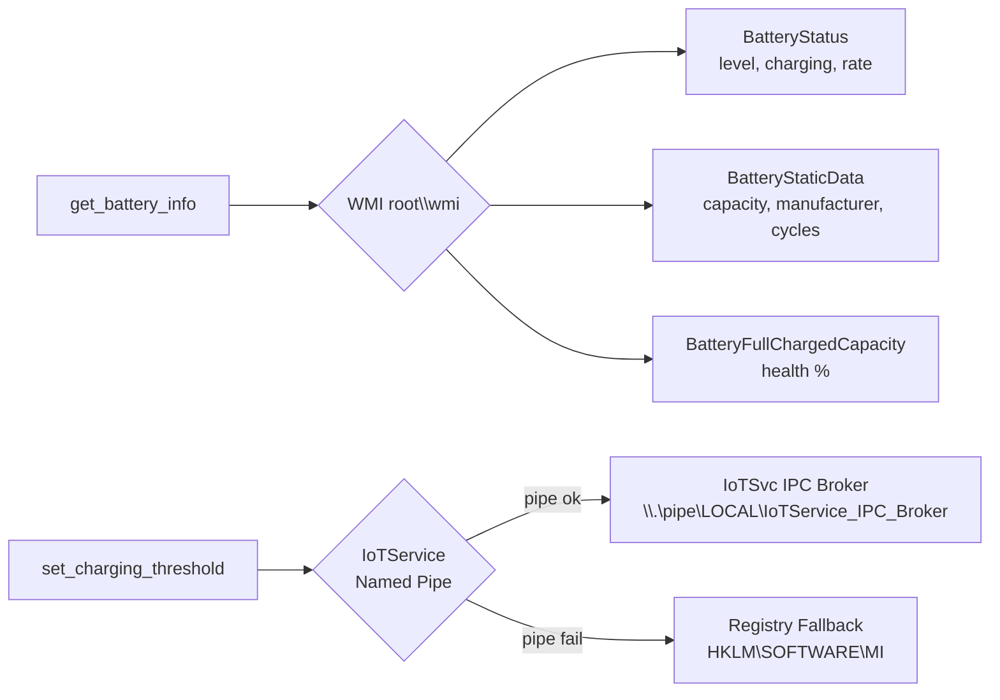

**Charge limit options:** `40%` / `50%` / `60%` / `70%` / `80%` *(recommended)*

---

### 🖥️ Display Control

Display management uses the Intel Graphics Control Library (`ControlLib.dll`) via Rust FFI (`libloading`). The DLL path is resolved from the hardware profile cache on startup. Brightness readback falls back to WMI `WmiMonitorBrightness` if IGCL is unavailable. The HDR and AI Adaptive Brightness features are gated in the UI by the `has_igcl` capability flag.

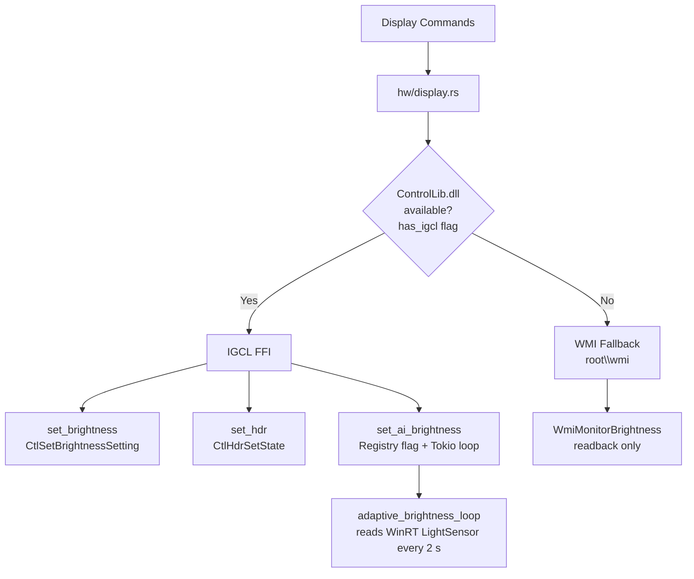

---

### 💡 Adaptive Brightness Sensitivity

When AI Adaptive Brightness is enabled, a Tokio background task (`adaptive_brightness_loop`) runs every 2 seconds. It reads the Windows ambient light sensor via the WinRT `LightSensor` API and computes a target brightness using a configurable sensitivity curve. The result is smoothed to avoid jarring transitions in unstable light conditions.

**Formula:**
$$\text{max\_lux} = \frac{2000}{\text{sensitivity} / 100}$$

$$\text{target} = \text{clamp}\!\left(\text{min} + \frac{\text{lux}}{\text{max\_lux}} \times (\text{max} - \text{min}),\ \text{min},\ \text{max}\right)$$

$$\text{smoothed}_{n} = \text{smoothed}_{n-1} + (\text{target} - \text{smoothed}_{n-1}) \times \left(1 - \frac{\text{smoothing}}{100}\right)$$

**Configurable parameters (registry `HKLM\SOFTWARE\MI\DisplaySettings`):**

| Parameter | Range | Default | Effect |
|---|---|---|---|
| `AiBrightnessMin` | 5–80% | 10% | Floor — never dims below this |
| `AiBrightnessMax` | 20–100% | 100% | Ceiling — never exceeds this |
| `AiBrightnessSensitivity` | 10–200 | 100 | 200 = full range reached at 1000 lux; 50 = at 4000 lux |
| `AiBrightnessSmoothing` | 0–90 | 30 | 0 = instant; 90 = ~40 s to reach target |

The sensitivity panel is exposed in the Display tab whenever the AI Adaptive Brightness toggle is ON, via a collapsible "Configure sensitivity…" section.

---

### 🌀 Fan Control

Fan RPM and GPU temperature are read via WMI. Fan mode and speed are persisted in the Windows Registry, which the system driver reads to apply the curve.

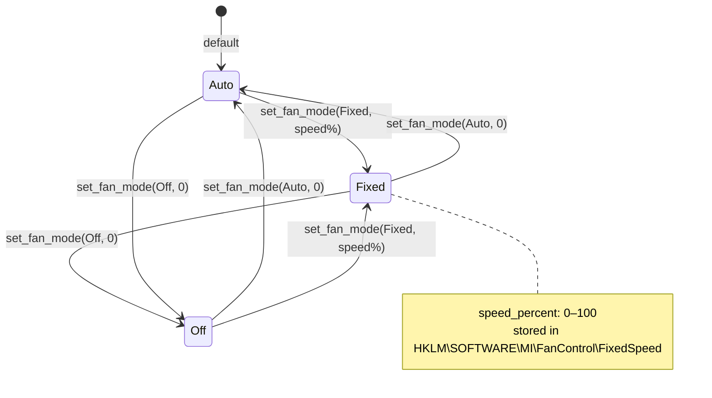

---

### 🖱️ Touchpad

Touchpad sensitivity and haptics are controlled by sending HID output reports directly to the `BLTP7853 COL04` device (HID Usage Page `0xFF00`). A 33-byte output report is sent via `HidD_SetOutputReport`. Settings are also mirrored to the registry for persistence across reboots. The HID device path is resolved from the hardware profile cache. The haptics toggle is gated in the UI by the `has_touchpad_hid` capability flag.

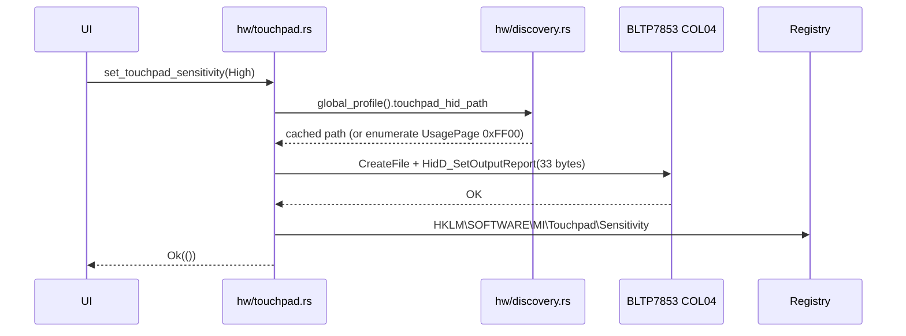

---

### 📊 System Info

System information is collected once at startup and refreshed on a 5-second polling interval via WMI `root\cimv2`.

| WMI Class | Data |
|---|---|
| `Win32_Processor` | Name, core count, thread count, load % |
| `Win32_VideoController` | GPU name |
| `Win32_PhysicalMemory` | Total RAM (MB) |
| `Win32_OperatingSystem` | OS caption, free RAM |

---

### 🔍 Hardware Discovery

On first launch MiControl scans all connected hardware and builds a `HardwareProfile` persisted to `AppData`. Subsequent launches load the cached profile instantly (~0 ms) and re-scan only on explicit user request. The profile drives path caching for all hardware modules and populates the `HardwareCapabilities` struct that gates UI features.

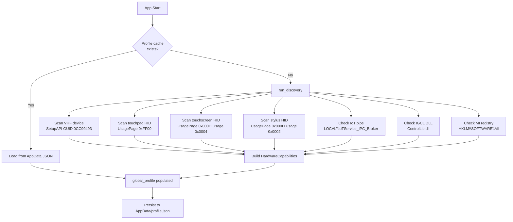

**Capability flags (`HardwareCapabilities`):**

| Flag | Meaning | Gated feature |
|---|---|---|
| `has_vhf_performance` | VHF driver found | Performance mode IOCTL |
| `has_touchpad_hid` | BLTP7853 HID path found | Touchpad haptics |
| `has_touchscreen` | Digitizer HID found | (display only) |
| `has_stylus` | Stylus HID found | (display only) |
| `has_igcl` | `ControlLib.dll` found | HDR + AI Adaptive Brightness |
| `has_iot_charging` | IoTService pipe reachable | Charging threshold |
| `has_mi_registry` | `HKLM\SOFTWARE\MI` present | Registry-based settings |

---

### 🚀 Startup Manager

Manages Windows autostart by writing/removing the app path from `HKCU\SOFTWARE\Microsoft\Windows\CurrentVersion\Run\MiControl`. No elevated privileges required.

---

### 🗂️ System Tray

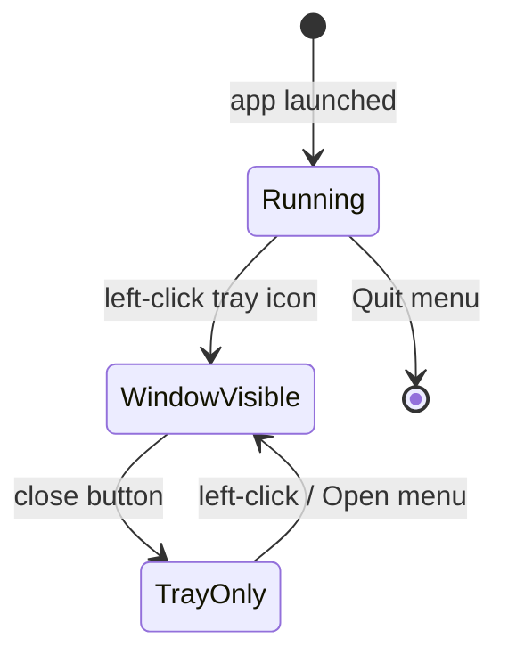

- Left-click tray icon → opens / focuses main window
- Right-click → context menu: **Open MiControl** / **Quit**
- Closing the window **hides to tray** (does not exit)
- `TrayPopup.tsx` provides a 300 px quick-actions panel

---

## AI System Advisor

The **AI System Advisor** card appears on the Overview tab. It collects the current hardware snapshot (CPU load, battery health, performance mode, fan state, display settings, detected capabilities) and sends it to an OpenAI-compatible chat completions endpoint. The AI returns personalised optimisation recommendations rendered inline.

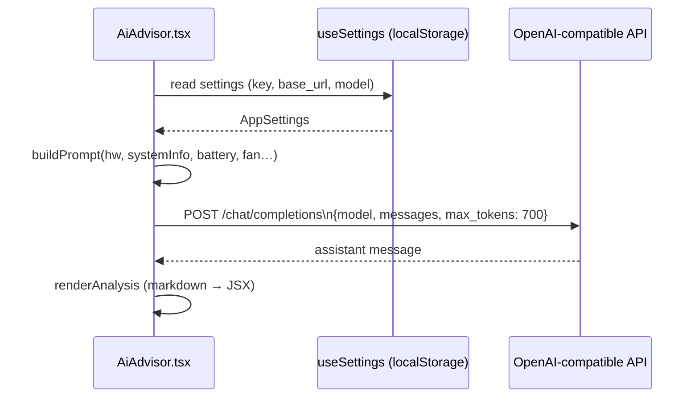

### Configuration (Settings tab)

| Setting | Default | Notes |
|---|---|---|
| API Key | *(empty)* | OpenAI `sk-…` or custom token |
| Base URL | `https://api.openai.com/v1` | Change for Ollama (`http://localhost:11434/v1`), Azure, LM Studio, etc. |
| Model | `gpt-4o-mini` | Preset buttons + custom text input |

Settings are stored exclusively in `localStorage` under the key `micontrol_settings_v1`. The key never leaves the device except to the configured API endpoint.

The CSP in `tauri.conf.json` is set to `connect-src 'self' https:` to permit these outbound fetch calls while blocking all other origins.

---

## Project Structure

```
micontrol/
├── src/                          # React frontend (TypeScript)
│   ├── main.tsx                  # Entry point
│   ├── App.tsx                   # Root component
│   ├── i18n/
│   │   └── en.json               # ← All UI strings (single source of truth)
│   ├── hooks/
│   │   ├── useHardware.ts        # Hardware polling + invoke() calls
│   │   ├── useSettings.ts        # AI API config (localStorage) + analyzeSystem()
│   │   └── useI18n.ts            # t(key, vars?) translation hook
│   ├── components/
│   │   ├── PerformanceModeSelector.tsx
│   │   ├── BatteryInfo.tsx
│   │   ├── ChargingThreshold.tsx
│   │   ├── DisplaySettings.tsx   # + adaptive brightness sensitivity panel
│   │   ├── FanControl.tsx
│   │   ├── TouchpadSettings.tsx  # + has_touchpad_hid capability gate
│   │   ├── StartupManager.tsx
│   │   ├── SystemInfoCard.tsx
│   │   ├── UpdateManager.tsx
│   │   ├── HardwareDiscovery.tsx # Phase 10 — profile + capability display
│   │   ├── AiAdvisor.tsx         # Collapsible AI analysis card
│   │   └── SettingsPage.tsx      # API key / model / URL configuration
│   ├── pages/
│   │   ├── MainWindow.tsx        # 10-tab sidebar layout
│   │   └── TrayPopup.tsx         # System tray quick panel
│   └── styles/
│       └── globals.css           # Dark theme
│
├── src-tauri/                    # Tauri + Rust backend
│   ├── tauri.conf.json           # App config, bundle, CSP (connect-src https:)
│   ├── Cargo.toml
│   ├── nsis/
│   │   └── installer-hooks.nsi   # Custom driver install macros
│   ├── icons/                    # App icons (32px, 128px, ico, icns)
│   └── src/
│       ├── main.rs               # Tauri entry point
│       ├── lib.rs                # App builder, 26 commands, tray, adaptive loop spawn
│       ├── state.rs              # AppState (Mutex<PerformanceMode>, Mutex<u8>)
│       ├── commands/
│       │   ├── hardware.rs       # get/set_performance_mode, get/set_charging_threshold
│       │   └── system.rs         # 22 remaining Tauri commands
│       └── hw/
│           ├── mod.rs
│           ├── discovery.rs      # HardwareProfile, HardwareCapabilities, global cache
│           ├── performance.rs    # VHF DeviceIoControl (uses cached path)
│           ├── battery.rs        # WMI root\wmi battery classes
│           ├── charging.rs       # IoTService named pipe (uses cached path)
│           ├── display.rs        # IGCL FFI + WMI + adaptive_brightness_loop
│           ├── fan.rs            # WMI Win32_Fan + registry
│           ├── touchpad.rs       # HID output report (uses cached path)
│           ├── system_info.rs    # WMI root\cimv2
│           ├── startup.rs        # HKCU Run key
│           └── update.rs         # BIOS + driver version checks
│
├── drivers/                      # Bundled hardware drivers
│   ├── VirtualControlHID/        # Performance mode VHF kernel driver
│   │   ├── VirtualControlHID.sys
│   │   └── virtualcontrolhid.inf
│   └── IoTDriver/                # Charging threshold + IoTService
│       ├── IoTDriver.sys
│       ├── IoTService.exe
│       └── iotdriver.inf
│
├── PLANNING.md                   # Development roadmap (all phases complete)
└── README.md                     # ← You are here
```

---

## Tech Stack

| Layer | Technology | Version |
|---|---|---|
| Shell | Tauri | 2.11.1 |
| Frontend framework | React | 19.1.0 |
| Frontend language | TypeScript | 5.8.3 |
| Build tool | Vite | 6.3.5 |
| Backend language | Rust | stable (1.95.0) |
| Async runtime | Tokio | 1 |
| Windows API | windows-rs | 0.58 |
| WMI | wmi-rs | 0.13 |
| Registry | winreg | 0.52 |
| Dynamic loading | libloading | 0.8 |
| Frontend tests | Vitest | 3.2.4 |
| Component tests | Testing Library | 16.3.0 |
| Installer | NSIS (via Tauri) | — |
| Package | MSI (via Tauri WiX) | — |

---

## Build & Installation

### Prerequisites

| Requirement | Notes |
|---|---|
| Windows 10/11 x64 | Required — hardware APIs are Windows-only |
| Rust stable | `rustup target add x86_64-pc-windows-msvc` |
| Node.js ≥ 20 | For the Vite frontend |
| VS Build Tools 2022 | MSVC toolchain + Windows SDK 10.0.26100.0 |
| Xiaomi Laptop | Tested on Mi Notebook Pro / Mi Laptop Pro series |

### Development Build

```powershell
# 1. Set up MSVC environment
$sdkVer = "10.0.26100.0"; $vcVer = "14.44.35207"
$env:LIB    = "...\VC\Tools\MSVC\$vcVer\lib\x64;..."
$env:INCLUDE = "...\VC\Tools\MSVC\$vcVer\include;..."

# 2. Install dependencies
cd micontrol
npm install

# 3. Run in dev mode (hot-reload frontend + Rust backend)
npx tauri dev
```

### Release Build

```powershell
# Produces installer + standalone exe in src-tauri/target/release/bundle/
npx tauri build
```

**Output artifacts:**

| Artifact | Path | Size |
|---|---|---|
| Standalone EXE | `target/release/micontrol.exe` | ~4.8 MB |
| NSIS Installer | `target/release/bundle/nsis/MiControl_0.1.0_x64-setup.exe` | ~1.95 MB |
| MSI Package | `target/release/bundle/msi/MiControl_0.1.0_x64_en-US.msi` | ~2.73 MB |

---

## Driver Installation

The NSIS installer automatically installs the required kernel drivers on first run via `pnputil`. **Drivers are intentionally not removed on uninstall** to avoid breaking the underlying hardware subsystem.

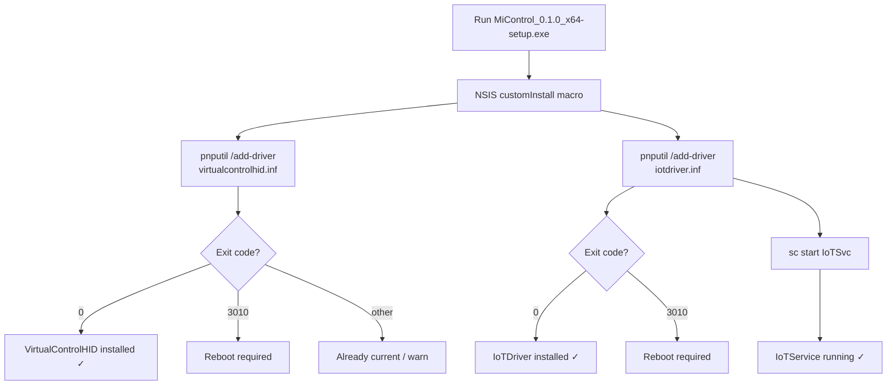

### Required drivers

| Driver | Purpose | Device GUID |
|---|---|---|
| `VirtualControlHID.sys` | Performance mode IOCTL | `{0CC99493-EB87-54F5-BB10-C0D5EA4A4F4C}` |
| `IoTDriver.sys` + `IoTService.exe` | Charging threshold IPC | ACPI `IOTD0000` |

---

## Internationalization

All UI text is stored in a single JSON file: [`src/i18n/en.json`](src/i18n/en.json).

The `useI18n` hook provides a `t(key, vars?)` function with:
- **Nested key traversal** — e.g. `t("performance.modes.turbo")`
- **Variable interpolation** — e.g. `t("performance.currentMode", { mode: "Turbo" })`
- **TypeScript safety** — `StringKey` type prevents typos at compile time

To add a new language, duplicate `en.json` as `pt.json` (or any locale), translate all values, and extend `useI18n.ts` to load the correct file based on the system locale.

---

## Testing

```powershell
# Frontend unit tests (Vitest)
npm test
# → 20/20 PASS

# Rust library tests
cargo test --lib
# → 6/6 PASS

# Coverage areas
# - Performance mode serialization + hw_value mapping
# - Battery WMI namespace (root\wmi)
# - Fan mode registry read/write
# - Touchpad sensitivity enum mapping
# - i18n key resolution + variable substitution
# - React component render smoke tests
```

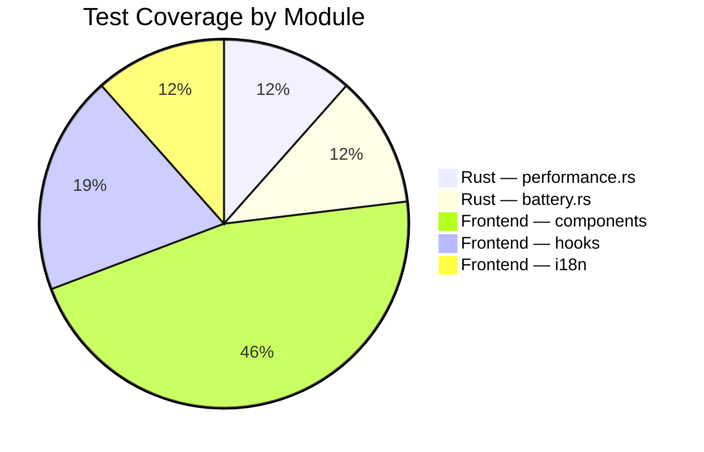

---

## Security

- **CSP** enforced in `tauri.conf.json`: `default-src 'self'; script-src 'self'; style-src 'self' 'unsafe-inline'; connect-src 'self' https:` — `https:` is the minimum required for optional AI API calls; all other remote origins remain blocked.
- **AI API key** stored only in browser `localStorage` — never sent to any server other than the user-configured API endpoint. The key is never persisted on disk by Tauri or passed through any Rust command.
- **No telemetry** — the app makes no outbound network calls unless the AI Advisor is explicitly used.
- **Principle of least privilege** — Registry writes use the minimum required key access (`KEY_WRITE`). Startup uses `HKCU` (no elevation needed).
- **Driver operations** require admin elevation (NSIS installer runs elevated by default).
- **Named pipe IPC** to `IoTService` uses the broker pattern — MiControl never talks directly to the kernel driver.
- **Hardware discovery** is read-only — no driver installation or registry mutation occurs during a scan.

---

## License

This project is provided as-is for personal use on Xiaomi hardware. The bundled drivers (`VirtualControlHID.sys`, `IoTDriver.sys`, `IoTService.exe`) are property of Xiaomi and were extracted from the official **XiaomiPCManager 5.8.0.57** package.


MiControl is a native Windows desktop application that exposes the full hardware control interface of Xiaomi laptops: performance modes, battery charging thresholds, display management, fan curves, touchpad settings, and more — all in a single, lightweight system-tray app.

---

## Table of Contents

- [Features](#features)
- [Architecture Overview](#architecture-overview)
- [IPC Command Map](#ipc-command-map)
- [Hardware Subsystems](#hardware-subsystems)
  - [Performance Mode](#-performance-mode)
  - [Battery & Charging](#-battery--charging)
  - [Display Control](#-display-control)
  - [Fan Control](#-fan-control)
  - [Touchpad](#-touchpad)
  - [System Info](#-system-info)
  - [Startup Manager](#-startup-manager)
  - [System Tray](#-system-tray)
- [Project Structure](#project-structure)
- [Tech Stack](#tech-stack)
- [Build & Installation](#build--installation)
  - [Prerequisites](#prerequisites)
  - [Development Build](#development-build)
  - [Release Build](#release-build)
- [Driver Installation](#driver-installation)
- [Internationalization](#internationalization)
- [Testing](#testing)
- [Security](#security)
- [License](#license)

---

## Features

| Category | Feature | Implementation |
|---|---|---|
| **Performance** | 7 performance modes (Silence → Turbo → Extreme) | VHF DeviceIoControl + Registry |
| **Battery** | Level, health, cycle count, temperature, voltage, time remaining | WMI `root\wmi` |
| **Charging** | Configurable charge limit (40 / 50 / 60 / 70 / 80%) | IoTService named pipe |
| **Display** | Brightness control (0–100%) | Intel IGCL (`ControlLib.dll`) |
| **Display** | HDR on/off | Intel IGCL `CtlHdrSetState` |
| **Display** | AI Adaptive Brightness | Intel IGCL ambient light API |
| **Display** | Current refresh rate readout | WMI `WmiMonitorBrightness` |
| **Fan** | Fan RPM readout | WMI `Win32_Fan` |
| **Fan** | GPU temperature | WMI `MSAcpi_ThermalZoneTemperature` |
| **Fan** | Fan mode: Auto / Fixed / Off | Registry `HKLM\SOFTWARE\MI\FanControl` |
| **Touchpad** | Sensitivity: Low / Medium / High / Max | HID output report (BLTP7853 COL04) |
| **Touchpad** | Haptic feedback toggle | HID output report + Registry |
| **System** | CPU name, cores, threads, usage % | WMI `Win32_Processor` |
| **System** | GPU name | WMI `Win32_VideoController` |
| **System** | RAM total / free | WMI `Win32_PhysicalMemory` |
| **System** | OS version | WMI `Win32_OperatingSystem` |
| **Startup** | Run at Windows startup | `HKCU\...\CurrentVersion\Run` |
| **Tray** | Minimize to system tray | Tauri tray icon |
| **Tray** | Quick-actions popup (300 px) | `TrayPopup.tsx` |
| **i18n** | All strings centralized in `en.json` | Custom `useI18n` hook |

---

## Architecture Overview

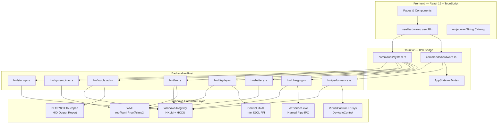

---

## IPC Command Map

All 18 Tauri commands available via `invoke()` in the frontend:

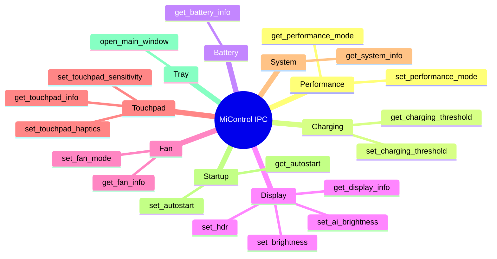

---

## Hardware Subsystems

### ⚡ Performance Mode

Controls the laptop's performance profile by sending IOCTL commands to the `VirtualControlHID.sys` kernel driver via the custom device interface GUID `{0CC99493-EB87-54F5-BB10-C0D5EA4A4F4C}`. The last mode is persisted to the Windows Registry as a fallback.

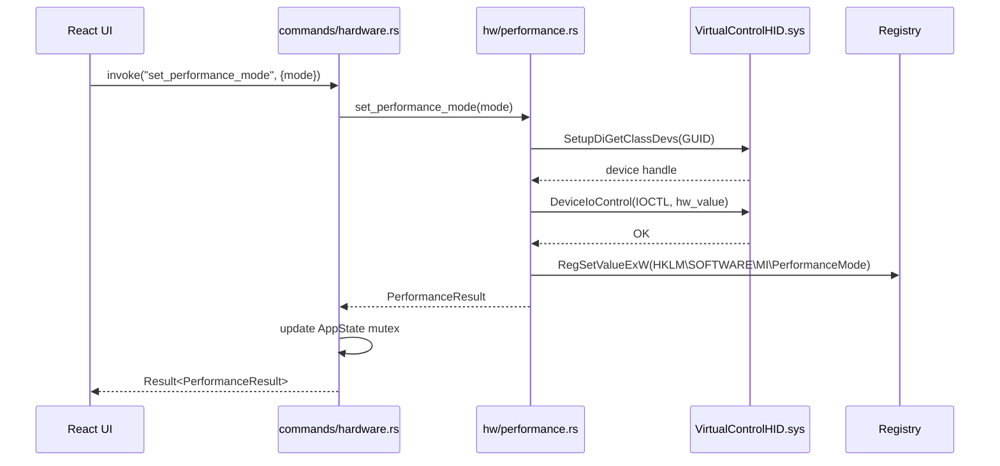

**Available modes:**

| Mode | HW Value | Description |
|---|---|---|
| `silence` | `0` | Quiet operation, fan off, reduced performance |
| `balance` | `1` | Balanced — recommended for most tasks *(default)* |
| `turbo` | `2` | Maximum performance |
| `decepticon` | `3` | Unlocked extreme mode (requires firmware unlock) |
| `smart` | `10` | Auto-adjusts based on workload |
| `long_battery` | `11` | Extended battery life, reduced performance |
| `smart_acceleration` | `14` | Temporary performance boost when needed |

---

### 🔋 Battery & Charging

Battery status is read from the WMI `root\wmi` namespace (not `root\cimv2`), which hosts the Xiaomi-specific ACPI battery classes. Charging threshold is controlled via the `IoTService` userland service through a named pipe.


**Charge limit options:** `40%` / `50%` / `60%` / `70%` / `80%` *(recommended)*

---

### 🖥️ Display Control

Display management uses the Intel Graphics Control Library (`ControlLib.dll`) via Rust FFI (`libloading`). Brightness readback falls back to WMI `WmiMonitorBrightness` if IGCL is unavailable.

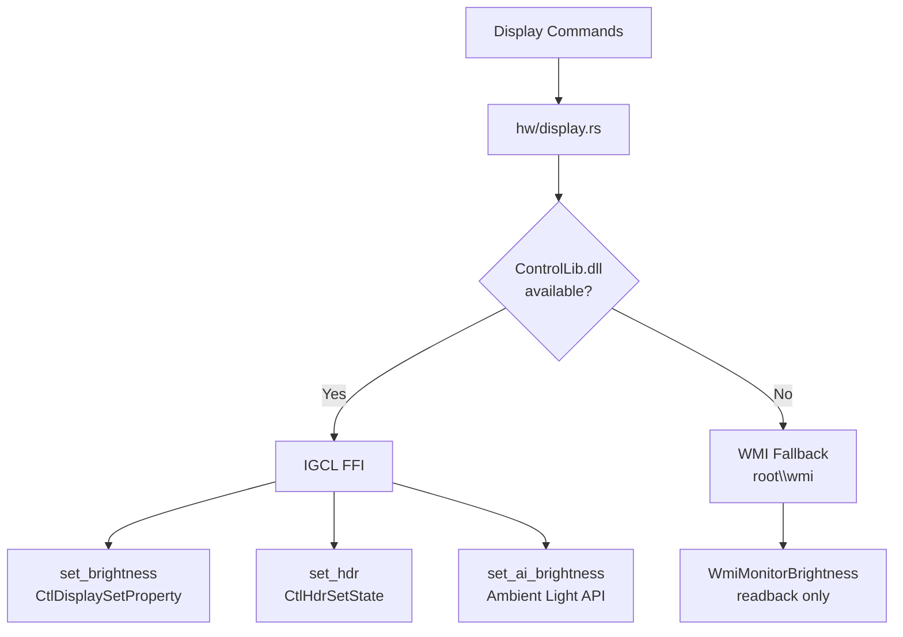

---

### 🌀 Fan Control

Fan RPM and GPU temperature are read via WMI. Fan mode and speed are persisted in the Windows Registry, which the system driver reads to apply the curve.


---

### 🖱️ Touchpad

Touchpad sensitivity and haptics are controlled by sending HID output reports directly to the `BLTP7853 COL04` device (HID Usage Page `0xFF00`). A 33-byte output report is sent via `HidD_SetOutputReport`. Settings are also mirrored to the registry for persistence across reboots.

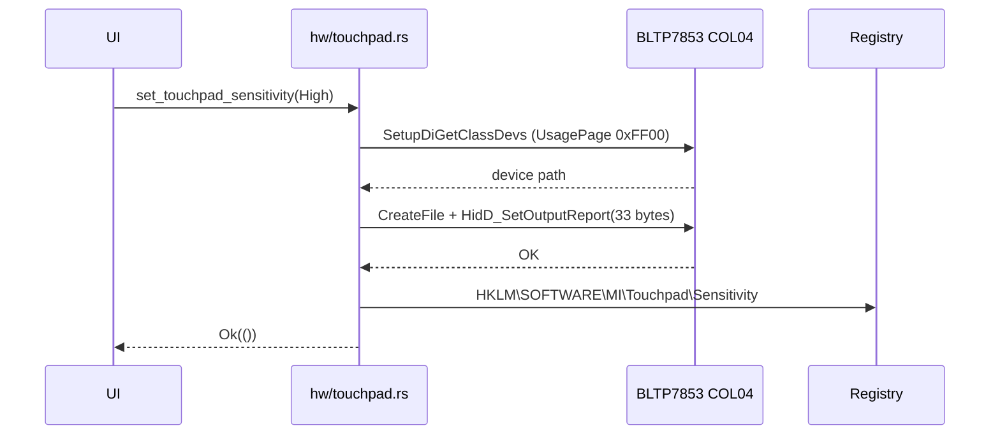

---

### 📊 System Info

System information is collected once at startup and refreshed on a 5-second polling interval via WMI `root\cimv2`.

| WMI Class | Data |
|---|---|
| `Win32_Processor` | Name, core count, thread count, load % |
| `Win32_VideoController` | GPU name |
| `Win32_PhysicalMemory` | Total RAM (MB) |
| `Win32_OperatingSystem` | OS caption, free RAM |

---

### 🚀 Startup Manager

Manages Windows autostart by writing/removing the app path from `HKCU\SOFTWARE\Microsoft\Windows\CurrentVersion\Run\MiControl`. No elevated privileges required.

---

### 🗂️ System Tray


- Left-click tray icon → opens / focuses main window
- Right-click → context menu: **Open MiControl** / **Quit**
- Closing the window **hides to tray** (does not exit)
- `TrayPopup.tsx` provides a 300 px quick-actions panel

---

## Project Structure

```
micontrol/
├── src/                          # React frontend (TypeScript)
│   ├── main.tsx                  # Entry point
│   ├── App.tsx                   # Root component
│   ├── i18n/
│   │   └── en.json               # ← All UI strings (single source of truth)
│   ├── hooks/
│   │   ├── useHardware.ts        # Hardware polling + invoke() calls
│   │   └── useI18n.ts            # t(key, vars?) translation hook
│   ├── components/
│   │   ├── PerformanceModeSelector.tsx
│   │   ├── BatteryInfo.tsx
│   │   ├── ChargingThreshold.tsx
│   │   ├── DisplaySettings.tsx
│   │   ├── FanControl.tsx
│   │   ├── TouchpadSettings.tsx
│   │   ├── StartupManager.tsx
│   │   └── SystemInfoCard.tsx
│   ├── pages/
│   │   ├── MainWindow.tsx        # 8-tab sidebar layout
│   │   └── TrayPopup.tsx         # System tray quick panel
│   └── styles/
│       └── globals.css           # Dark theme
│
├── src-tauri/                    # Tauri + Rust backend
│   ├── tauri.conf.json           # App config, bundle, security CSP
│   ├── Cargo.toml
│   ├── nsis/
│   │   └── installer-hooks.nsi   # Custom driver install macros
│   ├── icons/                    # App icons (32px, 128px, ico, icns)
│   └── src/
│       ├── main.rs               # Tauri entry point
│       ├── lib.rs                # App builder, command registry, tray setup
│       ├── state.rs              # AppState (Mutex<PerformanceMode>, Mutex<u8>)
│       ├── commands/
│       │   ├── hardware.rs       # get/set_performance_mode, get/set_charging_threshold
│       │   └── system.rs         # 14 remaining Tauri commands
│       └── hw/
│           ├── performance.rs    # VHF DeviceIoControl
│           ├── battery.rs        # WMI root\wmi battery classes
│           ├── charging.rs       # IoTService named pipe
│           ├── display.rs        # Intel IGCL FFI + WMI fallback
│           ├── fan.rs            # WMI Win32_Fan + registry
│           ├── touchpad.rs       # HID output report (BLTP7853)
│           ├── system_info.rs    # WMI root\cimv2
│           └── startup.rs        # HKCU Run key
│
├── drivers/                      # Bundled hardware drivers
│   ├── VirtualControlHID/        # Performance mode VHF kernel driver
│   │   ├── VirtualControlHID.sys
│   │   └── virtualcontrolhid.inf
│   └── IoTDriver/                # Charging threshold + IoTService
│       ├── IoTDriver.sys
│       ├── IoTService.exe
│       └── iotdriver.inf
│
├── PLANNING.md                   # Development roadmap (all phases complete)
└── README.md                     # ← You are here
```

---

## Tech Stack

| Layer | Technology | Version |
|---|---|---|
| Shell | Tauri | 2.11.1 |
| Frontend framework | React | 19.1.0 |
| Frontend language | TypeScript | 5.8.3 |
| Build tool | Vite | 6.3.5 |
| Backend language | Rust | stable (1.95.0) |
| Async runtime | Tokio | 1 |
| Windows API | windows-rs | 0.58 |
| WMI | wmi-rs | 0.13 |
| Registry | winreg | 0.52 |
| Dynamic loading | libloading | 0.8 |
| Frontend tests | Vitest | 3.2.4 |
| Component tests | Testing Library | 16.3.0 |
| Installer | NSIS (via Tauri) | — |
| Package | MSI (via Tauri WiX) | — |

---

## Build & Installation

### Prerequisites

| Requirement | Notes |
|---|---|
| Windows 10/11 x64 | Required — hardware APIs are Windows-only |
| Rust stable | `rustup target add x86_64-pc-windows-msvc` |
| Node.js ≥ 20 | For the Vite frontend |
| VS Build Tools 2022 | MSVC toolchain + Windows SDK 10.0.26100.0 |
| Xiaomi Laptop | Tested on Mi Notebook Pro / Mi Laptop Pro series |

### Development Build

```powershell
# 1. Set up MSVC environment
$sdkVer = "10.0.26100.0"; $vcVer = "14.44.35207"
$env:LIB    = "...\VC\Tools\MSVC\$vcVer\lib\x64;..."
$env:INCLUDE = "...\VC\Tools\MSVC\$vcVer\include;..."

# 2. Install dependencies
cd micontrol
npm install

# 3. Run in dev mode (hot-reload frontend + Rust backend)
npx tauri dev
```

### Release Build

```powershell
# Produces installer + standalone exe in src-tauri/target/release/bundle/
npx tauri build
```

**Output artifacts:**

| Artifact | Path | Size |
|---|---|---|
| Standalone EXE | `target/release/micontrol.exe` | ~4.8 MB |
| NSIS Installer | `target/release/bundle/nsis/MiControl_0.1.0_x64-setup.exe` | ~1.95 MB |
| MSI Package | `target/release/bundle/msi/MiControl_0.1.0_x64_en-US.msi` | ~2.73 MB |

---

## Driver Installation

The NSIS installer automatically installs the required kernel drivers on first run via `pnputil`. **Drivers are intentionally not removed on uninstall** to avoid breaking the underlying hardware subsystem.

```mermaid
flowchart TD
    A[Run MiControl_0.1.0_x64-setup.exe] --> B[NSIS customInstall macro]
    B --> C[pnputil /add-driver\nvirtualcontrolhid.inf]
    B --> D[pnputil /add-driver\niotdriver.inf]
    C --> E{Exit code?}
    D --> F{Exit code?}
    E -->|0| G[VirtualControlHID installed ✓]
    E -->|3010| H[Reboot required]
    E -->|other| I[Already current / warn]
    F -->|0| J[IoTDriver installed ✓]
    F -->|3010| K[Reboot required]
    D --> L[sc start IoTSvc]
    L --> M[IoTService running ✓]
```

### Required drivers

| Driver | Purpose | Device GUID |
|---|---|---|
| `VirtualControlHID.sys` | Performance mode IOCTL | `{0CC99493-EB87-54F5-BB10-C0D5EA4A4F4C}` |
| `IoTDriver.sys` + `IoTService.exe` | Charging threshold IPC | ACPI `IOTD0000` |

---

## Internationalization

All UI text is stored in a single JSON file: [`src/i18n/en.json`](src/i18n/en.json).

The `useI18n` hook provides a `t(key, vars?)` function with:
- **Nested key traversal** — e.g. `t("performance.modes.turbo")`
- **Variable interpolation** — e.g. `t("performance.currentMode", { mode: "Turbo" })`
- **TypeScript safety** — `StringKey` type prevents typos at compile time

To add a new language, duplicate `en.json` as `pt.json` (or any locale), translate all values, and extend `useI18n.ts` to load the correct file based on the system locale.

---

## Testing

```powershell
# Frontend unit tests (Vitest)
npm test
# → 20/20 PASS

# Rust library tests
cargo test --lib
# → 6/6 PASS

# Coverage areas
# - Performance mode serialization + hw_value mapping
# - Battery WMI namespace (root\wmi)
# - Fan mode registry read/write
# - Touchpad sensitivity enum mapping
# - i18n key resolution + variable substitution
# - React component render smoke tests
```

```mermaid
pie title Test Coverage by Module
    "Rust — performance.rs" : 3
    "Rust — battery.rs" : 3
    "Frontend — components" : 12
    "Frontend — hooks" : 5
    "Frontend — i18n" : 3
```

---

## Security

- **CSP** enforced in `tauri.conf.json`: `default-src 'self'; script-src 'self'` — no remote code execution surface.
- **No network requests** — the app is entirely local; no telemetry, no cloud endpoints.
- **Principle of least privilege** — Registry writes use the minimum required key access (`KEY_WRITE`). Startup uses `HKCU` (no elevation needed).
- **Driver operations** require admin elevation (NSIS installer runs elevated by default).
- **Named pipe IPC** to `IoTService` uses the broker pattern — MiControl never talks directly to the kernel driver.

---

## License

This project is provided as-is for personal use on Xiaomi hardware. The bundled drivers (`VirtualControlHID.sys`, `IoTDriver.sys`, `IoTService.exe`) are property of Xiaomi and were extracted from the official **XiaomiPCManager 5.8.0.57** package.
