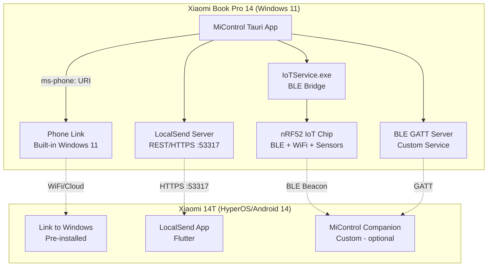
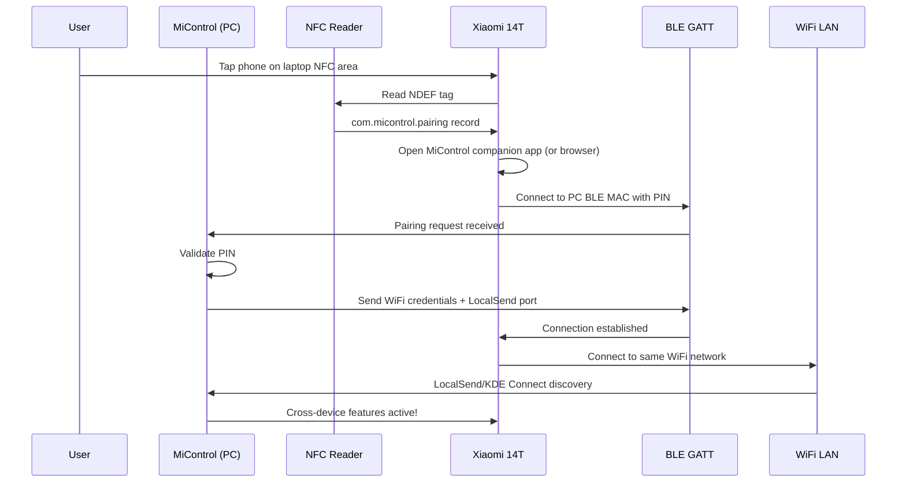

# Cross-Device & Open-Source Alternatives Report

> **Date:** 2026-07-30
> **Machine:** Xiaomi Book Pro 14 (TM2424) + Xiaomi 14T
> **MiControl Version:** 0.1.13
> **Branch:** `feature/hardware-gap-implementation`
> **Investigation Method:** Consultor online research, reverse-engineering analysis of XPM binaries (Ghidra decompilation), BLE GATT protocol analysis, open-source project evaluation

---

## Executive Summary

This report analyzes solutions for the 5 remaining unimplemented gaps from `HARDWARE_GAP_ANALYSIS.md` and proposes a comprehensive cross-device architecture to replace Xiaomi's proprietary Lyra framework. The user has a Xiaomi 14T phone and a Xiaomi Book Pro 14 — both in the Xiaomi ecosystem — and wants full cross-device functionality.

**Key findings:**

- ✅ **Phone Link (Windows) + Link to Windows (Android)** is the native cross-device solution already built into both OSes — Xiaomi 14T is officially supported for all features including screen mirroring, app streaming, calls, SMS, notifications, clipboard sync, and file transfer
- ✅ **MiControl should orchestrate Phone Link** rather than reimplementing its features — launch via `ms-phone:` URI, detect connection status, and provide a unified UI wrapper
- ✅ **LocalSend** remains the best solution for **file transfer** (Phone Link's file transfer is limited to drag-and-drop photos)
- ✅ **All 5 remaining gaps have viable solutions** using open-source alternatives and native Windows features
- ⚠️ **Xiaomi's native Lyra/mi_connect framework cannot be used** — it's proprietary, undocumented, and not exposed to third-party Windows apps
- ✅ **The IoT chip (nRF52) in the laptop is accessible** via existing IoTService BLE GATT bridge — we can use it for device discovery, WiFi config, and sensor data
- ✅ **Xiaomi's official driver download portal** is publicly accessible at `mi.com/service/notebook/drivers/{modelCode}` — MiControl can scrape and compare installed drivers against the official database
- 🎯 **Recommended strategy**: Use Phone Link as the primary cross-device backbone, LocalSend for file transfer, whisper.cpp/sherpa-onnx for subtitles, ArgyllCMS for color calibration, MpCmdRun for security scan, and Xiaomi's official driver portal for driver updates

---

## 1. Remaining Gaps — Open-Source Solutions

### Gap 7: NFC Tap-to-Pair → Custom NDEF + BLE Handshake

**XPM approach:** Writes proprietary NDEF tag to NFC SRAM at `0x10a800`, triggering Xiaomi's `mi_connect_service` on the phone.

**Problem:** Xiaomi's NDEF format is proprietary. The phone-side `mi_connect_service` requires system-level permissions — third-party apps cannot trigger it.

**Solution: Custom NFC pairing for our own protocol**

| Component         | Technology                                             | License          | Feasibility |
| ----------------- | ------------------------------------------------------ | ---------------- | ----------- |
| NFC tag write     | `Windows.Networking.Proximity.ProximityDevice` (WinRT) | Windows built-in | ✅ High     |
| NDEF record       | Custom external type `com.micontrol.pairing`           | N/A              | ✅ High     |
| Pairing handshake | BLE GATT custom service after NFC tap                  | N/A              | ✅ High     |
| Phone-side app    | Custom companion app (Android)                         | MIT              | 🟡 Medium   |

**How it works:**

1. User taps phone on laptop NFC area
2. PC writes NDEF record with: device name, BLE MAC address, pairing PIN
3. Phone receives NDEF → opens MiControl companion app (or browser URL if app not installed)
4. Companion app connects to PC via BLE GATT using the provided MAC + PIN
5. BLE connection established → upgrade to WiFi Direct or TCP for data transfer

**Alternative (no companion app):** Write an NDEF URI record that opens a web page on the phone (e.g., `https://micontrol.local/pair?mac=XX:XX&pin=123456`). The web page initiates a Web Bluetooth connection to the PC. This works without any app installation.

**Windows API:** `ProximityDevice.GetDefault()` → `PublishMessage("Windows:WriteTag", ...)` or `PublishBinaryMessage("NDEF:WriteTag", ...)`

---

### Gap 8: Distributed Camera → Phone Link + scrcpy fallback

**XPM approach:** `MiDistributedCameraBroker.exe` + `VirtualCameraSDK.dll` over Lyra IPC.

**Problem:** Proprietary Lyra protocol, cannot be replicated.

**Solution: Phone Link (primary) + scrcpy (fallback)**

Phone Link on Windows 11 already supports using the Android phone's camera as a webcam. The Xiaomi 14T is officially listed as a supported device for all Phone Link features. MiControl should orchestrate Phone Link rather than reimplementing camera streaming.

| Component                  | Technology                              | License      | Feasibility |
| -------------------------- | --------------------------------------- | ------------ | ----------- |
| **Phone camera as webcam** | **Phone Link** (built-in Windows 11)    | **Built-in** | ✅ **High** |
| Phone camera capture       | scrcpy `--video-source=camera`          | Apache 2.0   | ✅ High     |
| Virtual webcam on Windows  | OBS Virtual Camera or DirectShow filter | GPL / MIT    | 🟡 Medium   |
| ADB connection             | USB or WiFi ADB                         | Android SDK  | ✅ High     |

**Primary approach (Phone Link):**

1. MiControl checks if Phone Link is installed and paired
2. If paired, MiControl launches Phone Link's camera feature via `ms-phone:` URI
3. Phone Link handles all the streaming, virtual camera driver, and connection management
4. User selects the phone camera in Zoom/Teams/Meet — it appears as a webcam automatically

**Fallback (scrcpy):**

If Phone Link is not available or camera feature is not supported:

1. MiControl launches `scrcpy --video-source=camera --camera-size=1920x1080 --no-window --record=-` (pipe to stdout)
2. Video stream piped to a virtual camera driver (OBS Virtual Camera or custom DirectShow filter)
3. Virtual camera appears as a system webcam in Zoom/Teams/Meet

**Xiaomi 14T specific:** Android 14+ supports USB UVC webcam mode natively — just plug in USB and select the phone as a camera. No software needed. MiControl can detect this and show a "Use phone as webcam (USB)" option that simply launches the camera app on the phone via ADB.

---

### Gap 10: Cross-Device Interconnect → Hybrid Open-Source Stack

**XPM approach:** Lyra IPC framework with 13 services (MiDrop, MiSmartShare, MiTelephone, etc.).

**Problem:** Lyra is completely proprietary — no public SDK, no documentation, no open-source implementation. Xiaomi does not expose cross-device APIs to third-party Windows developers.

**Solution: Multi-protocol hybrid stack**

This is the most complex gap. See **Section 2** below for the full architecture.

---

### Gap 11 (remaining): Subtitle Transcription → whisper.cpp / sherpa-onnx

**XPM approach:** `SubtitleTranscriptor.dll` + `LibAivsAdapter.dll` (proprietary).

**Solution: On-device speech-to-text**

| Engine          | Language | Real-Time             | Rust Binding                    | License    | Stars |
| --------------- | -------- | --------------------- | ------------------------------- | ---------- | ----- |
| **whisper.cpp** | C/C++    | ✅ (500ms sampling)   | ✅ `whisper-rs`                 | MIT        | 52.4k |
| **sherpa-onnx** | C++      | ✅ (native streaming) | ✅ (Rust API + Tauri examples!) | Apache 2.0 | 13.9k |
| faster-whisper  | Python   | ✅                    | ❌                              | MIT        | 24.6k |

**Recommended: sherpa-onnx**

- Has **native Tauri examples** in the repo (`tauri-examples/` directory)
- Native streaming ASR (not chunked batch like Whisper)
- Supports VAD, speaker diarization, keyword spotting, TTS — all in one
- Uses ONNX Runtime (supports NPUs)
- Apache 2.0 license — fully compatible

**Alternative: whisper.cpp via `whisper-rs`**

- Better accuracy with large models
- Vulkan GPU support (cross-vendor)
- Q5_0 quantization reduces memory to ~1GB for small model
- MIT license

**Implementation:**

1. Bundle sherpa-onnx native library with MiControl
2. Add `whisper-rs` or sherpa-onnx Rust binding to Cargo.toml
3. Create `src-tauri/src/hw/subtitles.rs` module
4. Capture system audio loopback → feed to STT engine → display as overlay
5. Tauri command: `start_subtitles()`, `stop_subtitles()`, `get_subtitle_stream()`

---

### Gap 17: ICC Color Calibration → ArgyllCMS / DisplayCAL

**XPM approach:** Proprietary `.m3d` 3D LUT files + `icc-client.pc.mi.com` cloud API + `InstallIcc.exe`.

**Solution: Open-source ICC profiling**

| Component                    | Technology                                         | License | Feasibility |
| ---------------------------- | -------------------------------------------------- | ------- | ----------- |
| ICC profile creation         | ArgyllCMS (`dispcal`, `dispread`, `colprof`)       | AGPL*   | ✅ High     |
| GUI wrapper                  | DisplayCAL (Python/wxPython)                       | GPL v3  | 🟡 Medium   |
| ICC profile loading          | Windows ICM API (`mscms.dll`) via `windows` crate  | MIT     | ✅ High     |
| Color temperature adjustment | Already implemented (eye_protection.rs gamma ramp) | N/A     | ✅ Done     |

**Implementation:**

1. Bundle ArgyllCMS command-line tools with MiControl
2. Create `src-tauri/src/hw/color_calibration.rs` module
3. Tauri commands: `start_calibration()`, `get_color_profile()`, `load_icc_profile(path)`
4. Call ArgyllCMS tools via `std::process::Command`, parse output
5. Load resulting ICC profile via Windows ICM API: `SetColorProfile` / WCS APIs

**Note:** ArgyllCMS is AGPL — check commercial use requirements. For open-source MiControl, this is fine.

**Alternative (simpler):** Use the existing `eye_protection.rs` gamma ramp implementation for color temperature adjustment, and point users to DisplayCAL for full hardware calibration. MiControl can launch DisplayCAL if installed.

---

### Gap 16: Security Scan → Windows Defender MpCmdRun.exe

**XPM approach:** `MiScanner.dll` (proprietary).

**Solution: Windows Defender CLI**

**MpCmdRun.exe key commands:**

```
# Quick scan
MpCmdRun.exe -Scan -ScanType 1

# Full scan
MpCmdRun.exe -Scan -ScanType 2

# Custom scan (file/folder)
MpCmdRun.exe -Scan -ScanType 3 -File "C:\path\to\scan"

# Update signatures
MpCmdRun.exe -SignatureUpdate

# Check exclusion
MpCmdRun.exe -CheckExclusion -Path "C:\path"
```

**Location:** `C:\ProgramData\Microsoft\Windows Defender\Platform\<version>\MpCmdRun.exe`

**Implementation:**

1. Create `src-tauri/src/hw/security_scan.rs` module
2. Tauri commands: `quick_scan()`, `full_scan()`, `scan_path(path)`, `update_signatures()`
3. Spawn MpCmdRun.exe via `std::process::Command`, parse exit code (0 = clean, 2 = malware found)
4. For in-memory scanning: use AMSI API via `windows` crate (`AmsiScanBuffer`/`AmsiScanString`)

---

## 2. Cross-Device Architecture — The Complete Plan

### 2.1 Why Not Use Xiaomi's Lyra Framework

| Reason                            | Detail                                                              |
| --------------------------------- | ------------------------------------------------------------------- |
| **No public SDK**                 | Lyra is completely proprietary, no documentation exists             |
| **No open-source implementation** | GitHub search for `lyra_rpc`, `micont_service` returns zero results |
| **No third-party access**         | Xiaomi does not expose cross-device APIs to Windows developers      |
| **Requires signed binaries**      | `micont_service.exe` requires Xiaomi code signing                   |
| **Requires Xiaomi account**       | Cloud features need OAuth authentication with Xiaomi servers        |
| **Phone-side is system-internal** | `mi_connect_service` on Android requires system permissions         |
| **Breaks on XPM updates**         | Reverse-engineering the pipe protocol would be fragile              |

**Verdict:** Lyra is a dead end for clean implementation. We build our own.

### 2.2 Proposed Architecture: MiControl Cross-Device (MCX)

The architecture uses a **three-tier strategy**:

1. **Tier 1 — Phone Link (native)**: Calls, SMS, notifications, clipboard, screen mirroring, app streaming, camera-as-webcam — all handled by Windows' built-in Phone Link + Android's Link to Windows. MiControl orchestrates via URI launch and status detection.
2. **Tier 2 — LocalSend (file transfer)**: Full-featured file transfer with drag-and-drop, batch send, and no file size limits. Uses LocalSend's open protocol (Apache 2.0).
3. **Tier 3 — BLE/IoT chip (device discovery)**: The laptop's nRF52 IoT chip acts as a BLE beacon for device discovery and WiFi provisioning, leveraging the existing IoTService bridge.



**Phone Link feature coverage (Xiaomi 14T officially supported):**

| Phone Link Feature      | Status           | MiControl Role                      |
| ----------------------- | ---------------- | ----------------------------------- |
| Phone calls             | ✅ Supported     | Launch Phone Link, show call UI     |
| SMS/MMS messaging       | ✅ Supported     | Launch Phone Link messaging         |
| Notification sync       | ✅ Supported     | Detect status, show badge in UI     |
| Cross-device copy/paste | ✅ Supported     | Auto-enabled when paired            |
| Photos                  | ✅ Supported     | Launch Phone Link photos view       |
| Screen mirroring        | ✅ Supported     | Launch Phone Link screen view       |
| App streaming           | ✅ Supported     | Launch Phone Link apps              |
| File transfer           | ✅ Drag-and-drop | Supplement with LocalSend for batch |
| Instant hotspot         | ✅ Supported     | Launch Phone Link hotspot           |
| Media controls          | ✅ Supported     | Launch Phone Link media player      |
| Camera-as-webcam        | ✅ Supported     | Launch Phone Link camera feature    |

### 2.3 Protocol Stack

| Layer                       | Protocol          | Port/Channel      | Purpose                          | License          |
| --------------------------- | ----------------- | ----------------- | -------------------------------- | ---------------- |
| **Discovery**               | BLE Advertisement | Company ID 0x038F | Device discovery (Xiaomi chip)   | N/A              |
| **Discovery**               | mDNS/Bonjour      | UDP 5353          | LocalSend discovery              | N/A              |
| **Discovery**               | UDP Multicast     | 224.0.0.167:53317 | LocalSend device discovery       | N/A              |
| **Calls/SMS/Notifications** | Phone Link        | WiFi/Cloud relay  | Full phone integration           | Windows built-in |
| **Screen Mirror**           | Phone Link        | WiFi/Cloud relay  | Screen mirroring + app streaming | Windows built-in |
| **Camera**                  | Phone Link        | WiFi/Cloud relay  | Phone camera as webcam           | Windows built-in |
| **File Transfer**           | LocalSend v2/v3   | HTTPS :53317      | File send/receive                | Apache 2.0       |
| **BLE Control**             | GATT 0xFFFF       | BLE               | IoT chip communication           | Existing         |
| **NFC Pairing**             | NDEF custom       | NFC               | Quick pairing trigger            | N/A              |

### 2.4 Feature Mapping: XPM vs MiControl Cross-Device

| XPM Feature                 | XPM Component               | MiControl Replacement      | Phone App Needed?  | Status      |
| --------------------------- | --------------------------- | -------------------------- | ------------------ | ----------- |
| **File Transfer (Mi Drop)** | MiDropTransfer.dll          | LocalSend protocol         | ✅ LocalSend app   | 🟢 Ready    |
| **Phone Calls**             | MiTelephone.dll             | **Phone Link** (built-in)  | ✅ Link to Windows | 🟢 Ready    |
| **SMS on PC**               | MiTelephone.dll             | **Phone Link** (built-in)  | ✅ Link to Windows | 🟢 Ready    |
| **Notification Sync**       | MiSmartShareDLL.dll         | **Phone Link** (built-in)  | ✅ Link to Windows | 🟢 Ready    |
| **Clipboard Sync**          | MiSmartShareDLL.dll         | **Phone Link** (built-in)  | ✅ Link to Windows | 🟢 Ready    |
| **Screen Cast**             | MiPlayCastSDK.dll           | **Phone Link** (built-in)  | ✅ Link to Windows | 🟢 Ready    |
| **App Streaming**           | MiMultiDeviceConnection.dll | **Phone Link** (built-in)  | ✅ Link to Windows | 🟢 Ready    |
| **Phone Camera**            | MiDistributedCamera.dll     | **Phone Link** (built-in)  | ✅ Link to Windows | 🟢 Ready    |
| **Instant Hotspot**         | MiSmartShareDLL.dll         | **Phone Link** (built-in)  | ✅ Link to Windows | 🟢 Ready    |
| **Media Controls**          | MiDistributedAudio.dll      | **Phone Link** (built-in)  | ✅ Link to Windows | 🟢 Ready    |
| **Device Discovery**        | MiMultiDeviceConnection.dll | BLE scan + mDNS            | ❌ No              | 🟡 To build |
| **NFC Pairing**             | nfc_data_reader_writer      | ProximityDevice + NDEF     | ✅ Companion app   | 🟡 To build |
| **App Handoff**             | handoff_svc.exe             | Custom deep-link protocol  | ✅ Companion app   | 🔴 Complex  |
| **Audio Routing**           | MiDistributedAudio.dll      | Core Audio API (existing)  | ❌ No              | 🟢 Ready    |
| **TWS Earbuds**             | libMiPods.dll               | Standard BLE audio pairing | ❌ No              | 🟢 Ready    |
| **Cloud Sync**              | MiSmartShareClrWrapper.dll  | Syncthing (optional)       | ✅ Syncthing app   | 🟡 Optional |

### 2.5 The IoT Chip Advantage

The Xiaomi Book Pro 14 has a **nRF52 IoT chip** built into the laptop. MiControl already communicates with it via IoTService.exe BLE GATT bridge. This chip provides:

| GATT Characteristic        | Purpose                           | MiControl Access       |
| -------------------------- | --------------------------------- | ---------------------- |
| **0xFFFF** (Service)       | Main GATT service                 | ✅ Via IoTService pipe |
| **0x2711** (WiFi Config)   | WiFi SSID/password/status CRUD    | ✅ Via IoTService pipe |
| **0x2712** (Device Config) | Model, firmware, bind status      | ✅ Via IoTService pipe |
| **0x3E9** (EC Events)      | EC notifications to chip          | ✅ Via IoTService pipe |
| **0x3EA** (Sensor Stream)  | Temperature, light, accelerometer | ✅ Via IoTService pipe |

**Key insight:** The IoT chip can act as a **BLE beacon** that Xiaomi phones can discover. When the phone detects the beacon, it can trigger a notification: "MiControl device nearby — tap to connect." This replaces the need for NFC tap-to-pair in many scenarios.

**BLE Advertisement format (Xiaomi):**

```
Company ID: 0x038F (Xiaomi Inc.)
Service UUID: 0xFE95 (Xiaomi Mi Service)
Frame Control + Product ID + Frame Counter + MAC + Capabilities
```

MiControl can configure the IoT chip to broadcast this advertisement, making the laptop discoverable by Xiaomi phones' built-in BLE scanners.

---

## 3. Implementation Roadmap

### Phase 1: Quick Wins (1-2 weeks)

These features require minimal code and use existing apps/protocols:

| Feature                    | Effort | Dependencies           | Impact                                                      |
| -------------------------- | ------ | ---------------------- | ----------------------------------------------------------- |
| **Phone Link integration** | 3 days | Phone Link paired      | Calls, SMS, notifications, clipboard, screen mirror, camera |
| **LocalSend integration**  | 3 days | LocalSend app on phone | File transfer works                                         |
| **scrcpy camera launcher** | 1 day  | USB debugging enabled  | Phone as webcam (fallback)                                  |
| **MpCmdRun security scan** | 2 days | None (built-in)        | Security scanning                                           |

**Phone Link integration approach:**

- Detect Phone Link installation via `Get-AppxPackage *YourPhone*`
- Detect pairing status via registry `HKCU\Software\Microsoft\YourPhone`
- Launch Phone Link via `ms-phone:` URI scheme
- Launch specific features via deep links (calls, messages, photos)
- Show Phone Link connection status in MiControl UI
- Provide guided setup wizard if Phone Link is not yet paired

**LocalSend integration approach:**

- Embed a LocalSend v2 server in MiControl's Rust backend using `axum` or `actix-web`
- Listen on port 53317 with self-signed HTTPS certificate
- Implement endpoints: `/register`, `/prepare-upload`, `/upload`, `/prepare-download`, `/download`, `/cancel`, `/info`
- Frontend: React component with drag-and-drop file zone
- Discovery: UDP multicast to `224.0.0.167:53317`

### Phase 2: BLE & NFC (3-4 weeks)

| Feature                     | Effort  | Dependencies                 | Impact                       |
| --------------------------- | ------- | ---------------------------- | ---------------------------- |
| **BLE device scanner**      | 5 days  | `windows` crate BLE APIs     | Discover nearby devices      |
| **IoT chip BLE beacon**     | 3 days  | Existing IoTService pipe     | Laptop discoverable by phone |
| **NFC tag writer**          | 3 days  | PC NFC reader (if available) | Tap-to-pair trigger          |
| **BLE GATT server**         | 7 days  | `windows` crate BLE APIs     | Custom pairing protocol      |
| **Companion app (Android)** | 10 days | Android Studio, Kotlin       | Phone-side integration       |

**BLE scanner implementation:**

```rust
use windows::Devices::Bluetooth::Advertisement::*;

// Create a BLE advertisement watcher
let watcher = BluetoothLEAdvertisementWatcher::new()?;
watcher.SetScanningMode(BluetoothLEScanningMode::Active)?;
watcher.Received(&TypedEventHandler::new(|_watcher, args| {
    // Check for Xiaomi company ID (0x038F) in manufacturer data
    // Extract device name, RSSI, service UUIDs
    Ok(())
}));
watcher.Start()?;
```

### Phase 3: Advanced Features (1-2 months)

| Feature                    | Effort  | Dependencies                    | Impact                        |
| -------------------------- | ------- | ------------------------------- | ----------------------------- |
| **Subtitle transcription** | 7 days  | sherpa-onnx or whisper-rs       | Real-time captions            |
| **ICC color calibration**  | 5 days  | ArgyllCMS bundled               | Display profiling             |
| **App handoff**            | 14 days | Custom protocol + companion app | Continue tasks across devices |
| **Scene detection**        | 10 days | Windows sensor APIs             | Auto performance profiles     |
| **Audio routing**          | 5 days  | Core Audio API                  | Multi-device audio switch     |

### Phase 4: Deep Integration (3+ months)

| Feature                           | Effort  | Dependencies              | Impact                    |
| --------------------------------- | ------- | ------------------------- | ------------------------- |
| **KDE Connect protocol (native)** | 20 days | Rust TLS + JSON           | No KDE Connect dependency |
| **Custom companion app**          | 30 days | Android Studio, Kotlin    | Full phone integration    |
| **IoT chip WiFi provisioning**    | 10 days | Existing IoTService pipe  | WiFi config from PC       |
| **Cross-device clipboard**        | 7 days  | KDE Connect or custom BLE | Clipboard sync            |

---

## 4. Technical Deep Dive: LocalSend Protocol

LocalSend is the recommended file transfer protocol. Here's the full v2 specification:

### 4.1 Discovery

```
UDP multicast to 224.0.0.167:53317
Payload: JSON
{
  "alias": "MiControl-BookPro14",
  "version": "2",
  "deviceModel": "TM2424",
  "deviceType": "desktop",
  "fingerprint": "sha256-of-tls-cert",
  "port": 53317,
  "protocol": "https",
  "download": true
}
```

### 4.2 File Send Flow

```
1. POST /api/localsend/v2/prepare-upload
   Body: { "info": { "alias": "MiControl-BookPro14", "version": "2" },
           "files": { "file1": { "id": "uuid", "fileName": "photo.jpg", "size": 12345, "fileType": "image", "preview": null } } }
   Response: { "files": { "file1": { "id": "uuid", "fileName": "photo.jpg", "token": "random-token" } } }

2. POST /api/localsend/v2/upload?sessionId=xxx&fileId=file1&token=random-token
   Body: raw binary file data
   Response: 200 OK

3. POST /api/localsend/v2/cancel?sessionId=xxx
   Response: 200 OK
```

### 4.3 Rust Implementation Sketch

```rust
// src-tauri/src/hw/cross_device/localsend.rs
use axum::{routing::post, Router, Json};
use rustls::ServerConfig;

async fn prepare_upload(body: Json<PrepareUploadRequest>) -> Json<PrepareUploadResponse> {
    // Validate request, generate tokens, return accepted files
}

async fn upload(params: Query<UploadParams>, body: Bytes) -> StatusCode {
    // Validate token, write file to disk
}

pub fn start_localsend_server(port: u16) {
    let app = Router::new()
        .route("/api/localsend/v2/register", post(register))
        .route("/api/localsend/v2/prepare-upload", post(prepare_upload))
        .route("/api/localsend/v2/upload", post(upload))
        .route("/api/localsend/v2/cancel", post(cancel))
        .route("/api/localsend/v2/info", get(info));

    // Start HTTPS server with self-signed cert
    let config = ServerConfig::with_certificates(generate_self_signed_cert());
    tokio::spawn(async move {
        axum::Server::bind(&format!("0.0.0.0:{}", port).parse().unwrap())
            .serve(app.into_make_service())
            .await
    });
}
```

---

## 5. Technical Deep Dive: KDE Connect Protocol

### 5.1 Protocol Overview

KDE Connect uses **JSON NetworkPackets** over **TLS-encrypted TCP** connections:

```json
{
  "id": 1234567890,
  "type": "kdeconnect.share.request",
  "body": {
    "filename": "document.pdf",
    "open": false
  },
  "version": 5,
  "payloadSize": 1048576,
  "payloadTransferInfo": {
    "port": 1739
  }
}
```

### 5.2 Discovery

- **UDP multicast** on the LAN (port 1716)
- Devices announce themselves with identity packets
- Each device maintains a list of known devices and their capabilities

### 5.3 Key Plugins to Implement

| Plugin                     | Package Type      | Purpose                          |
| -------------------------- | ----------------- | -------------------------------- |
| `kdeconnect.share`         | File/URL sharing  | Send/receive files               |
| `kdeconnect.clipboard`     | Clipboard sync    | Copy/paste between devices       |
| `kdeconnect.notifications` | Notification sync | Mirror phone notifications on PC |
| `kdeconnect.sms`           | SMS access        | Read/send SMS from PC            |
| `kdeconnect.battery`       | Battery status    | Phone battery on PC              |
| `kdeconnect.mousepad`      | Remote input      | Phone as touchpad/keyboard       |
| `kdeconnect.mpris`         | Media control     | Control phone media playback     |
| `kdeconnect.runcommand`    | Remote commands   | Execute PC commands from phone   |

### 5.4 Implementation Strategy

**Option A (Recommended): Bundle KDE Connect**

- Install KDE Connect silently alongside MiControl
- MiControl launches KDE Connect in the background
- Frontend communicates with KDE Connect via its DBus interface (or process IPC)
- Pro: Full feature set immediately
- Con: Additional ~50MB dependency, GPL license

**Option B: Native Rust Implementation**

- Implement KDE Connect protocol natively in Rust
- Use `rustls` for TLS, `serde_json` for packets
- Pro: No external dependency, full control
- Con: 2-3 weeks of development, must keep up with protocol changes

---

## 6. Technical Deep Dive: BLE & IoT Chip

### 6.1 Existing BLE Bridge

MiControl already communicates with the nRF52 IoT chip via IoTService.exe. The pipe protocol uses the **MIPC** wire format:

```
[MIPC magic: 4 bytes] [src_id: u16] [dst_id: u16] [msg_type: u32] [payload_len: u16] [payload...]
```

### 6.2 BLE GATT Characteristics (from Ghidra decompilation)

| Handle | Name          | Access | Purpose                                |
| ------ | ------------- | ------ | -------------------------------------- |
| 0xFFFF | Main Service  | —      | Primary GATT service                   |
| 0x2711 | WiFi Config   | R/W/N  | WiFi SSID, password, status            |
| 0x2712 | Device Config | R/W/N  | Model, firmware, bind status           |
| 0x3E9  | EC Events     | W      | EC notifications to chip               |
| 0x3EA  | Sensor Stream | N      | Temperature, light, accelerometer data |

### 6.3 Using the IoT Chip for Cross-Device

The IoT chip can serve as a **BLE bridge** between the laptop and the phone:

1. **Beacon mode**: IoT chip broadcasts Xiaomi BLE advertisement → phone detects laptop nearby
2. **WiFi provisioning**: MiControl configures WiFi on the IoT chip → chip connects to same network as phone → LocalSend/KDE Connect discovery works
3. **Sensor data**: IoT chip streams sensor data (temperature, light) → MiControl uses for scene detection
4. **EC events**: IoT chip receives EC events (Fn key press, lid close) → MiControl triggers cross-device actions

### 6.4 Direct BLE Communication (without IoT chip)

MiControl can also communicate directly with the phone via BLE using the `windows` crate:

```rust
use windows::Devices::Bluetooth::*;

// Scan for BLE devices
let watcher = BluetoothLEAdvertisementWatcher::new()?;
watcher.SetScanningMode(BluetoothLEScanningMode::Active)?;

// Connect to a specific device
let device = BluetoothLEDevice::FromBluetoothAddressAsync(mac_address)?.await?;
let services = device.GetGattServicesAsync()?.await?;

// Read/write GATT characteristics
let characteristic = services.GetAt(0).GetCharacteristics()?.GetAt(0);
let result = characteristic.ReadValueAsync()?.await?;
```

---

## 7. NFC Tap-to-Pair — Detailed Design

### 7.1 NDEF Record Format

```
NDEF Record:
  TNF: External Type (0x04)
  Type: com.micontrol.pairing (ASCII)
  Payload: {
    "version": 1,
    "device_name": "MiControl-BookPro14",
    "ble_mac": "AA:BB:CC:DD:EE:FF",
    "pin": "123456",
    "wifi_ssid": "MyNetwork",
    "localsend_port": 53317
  }
```

### 7.2 Pairing Flow



### 7.3 Windows NFC API

```rust
use windows::Networking::Proximity::*;

fn write_nfc_pairing_tag(device_name: &str, ble_mac: &str, pin: &str) -> Result<()> {
    let device = ProximityDevice::GetDefault()?;
    let payload = format!(
        r#"{{"version":1,"device_name":"{}","ble_mac":"{}","pin":"{}"}}"#,
        device_name, ble_mac, pin
    );

    // Publish as NDEF message
    let writer = DataWriter::new()?;
    writer.WriteUInt32(payload.len() as u32);
    writer.WriteString(&payload);

    device.PublishMessage("Windows:WriteTag", writer.DetachBuffer()?, &MessageTransmittedHandler::new(|_, _| {}))?;
    Ok(())
}
```

---

## 8. Solution Comparison Matrix

| Solution        | Stars  | License    | Language     | Windows | Android | Use Case                          |
| --------------- | ------ | ---------- | ------------ | ------- | ------- | --------------------------------- |
| **Phone Link**  | —      | Built-in   | UWP/C++      | ✅      | ✅      | Full cross-device (native)        |
| **LocalSend**   | 86.4k  | Apache 2.0 | Flutter+Rust | ✅      | ✅      | File transfer                     |
| **KDE Connect** | 8k+    | GPL v2/v3  | Qt/C++       | ✅      | ✅      | Cross-device (fallback)           |
| **scrcpy**      | 146.7k | Apache 2.0 | C/Java       | ✅      | ✅      | Screen mirror + camera (fallback) |
| **sherpa-onnx** | 13.9k  | Apache 2.0 | C++          | ✅      | ✅      | Speech-to-text                    |
| **whisper.cpp** | 52.4k  | MIT        | C/C++        | ✅      | ✅      | Speech-to-text                    |
| **ArgyllCMS**   | —      | AGPL       | C            | ✅      | ❌      | Color calibration                 |
| **DisplayCAL**  | —      | GPL v3     | Python       | ✅      | ❌      | Color calibration GUI             |
| **Syncthing**   | 67k    | MPL 2.0    | Go           | ✅      | ✅      | Continuous file sync              |
| **PairDrop**    | 4k+    | GPL v3     | JS           | ✅      | ✅      | Web-based sharing                 |

---

## 9. The "Xiaomi Ecosystem" Problem

The user reports: _"Funcionalidade não suportada porque os dispositivos usam SO diferente"_ when tapping the Xiaomi 14T on the trackpad/NFC area.

### Root Cause Analysis

This message comes from the **phone-side** `mi_connect_service`. When the phone detects an NFC tag from the laptop, it tries to connect via Xiaomi's Lyra framework. The connection fails because:

1. **XPM is not installed** on the laptop (it was uninstalled)
2. Even if XPM were installed, the `micont_service.exe` requires the same Xiaomi account on both devices
3. The phone's `mi_connect_service` checks for a compatible Lyra endpoint and finds none

### Solutions

| Solution                            | Effort  | Requires Phone App?                       | Native Feel?                              |
| ----------------------------------- | ------- | ----------------------------------------- | ----------------------------------------- |
| **Phone Link (recommended)**        | 3 days  | ✅ Link to Windows (pre-installed on 14T) | ✅ Full native Windows/Android experience |
| **Install XPM alongside MiControl** | 0 days  | ❌                                        | ✅ Full Xiaomi experience                 |
| **LocalSend**                       | 1 week  | ✅ LocalSend app                          | 🟡 Different UI but same features         |
| **Custom companion app**            | 1 month | ✅ Custom app                             | ✅ Can match MiControl UI                 |
| **Web Bluetooth pairing**           | 2 weeks | ❌ (browser)                              | 🟡 Web-based                              |

### Recommended: Phone Link-First Approach

1. **Phone Link is the primary cross-device solution** — it's already built into Windows 11 and the Xiaomi 14T has "Link to Windows" pre-installed
2. MiControl detects Phone Link status and provides a **guided setup wizard** for pairing
3. MiControl launches Phone Link features via `ms-phone:` URI
4. **LocalSend** supplements Phone Link for full-featured file transfer (Phone Link's file transfer is limited to drag-and-drop photos)
5. **scrcpy** is a fallback for camera-as-webcam if Phone Link's camera feature is unavailable
6. Long-term: Build a **custom companion app** for NFC tap-to-pair and BLE device discovery

### Coexistence with XPM

MiControl, Phone Link, and XPM can all coexist:

- **Phone Link**: Handles calls, SMS, notifications, clipboard, screen mirror, camera — no conflict with MiControl
- **EC access**: MiControl uses IoTService pipe; XPM uses its own IoTDriver — they share the same driver, which supports multiple clients
- **BLE**: Both can scan simultaneously; MiControl should not advertise if XPM is running
- **WiFi**: No conflict — all use standard networking
- **Detection**: MiControl checks for `XiaomiPcManager.exe` process and `micont_service.exe` — if running, shows XPM status but does not disable Phone Link (they serve different purposes)

---

## 10. Summary: What to Build Next

### Priority 1: Phone Link Integration — 3 days

- Detect Phone Link installation and pairing status
- Launch Phone Link via `ms-phone:` URI
- Show connection status badge in MiControl UI
- Provide guided setup wizard for pairing Xiaomi 14T
- **Result**: Calls, SMS, notifications, clipboard, screen mirror, camera — all native

### Priority 2: File Transfer (LocalSend) — 1 week

- Embed LocalSend v2 server in MiControl Rust backend
- React frontend with drag-and-drop file zone
- User installs LocalSend app on Xiaomi 14T
- **Result**: Full file transfer between PC and phone

### Priority 3: Phone Camera Fallback (scrcpy) — 2 days

- Launch scrcpy with `--video-source=camera`
- Pipe to OBS Virtual Camera or use DroidCam
- **Result**: Phone camera as webcam (fallback when Phone Link camera unavailable)

### Priority 4: Subtitle Transcription (sherpa-onnx) — 1 week

- Add sherpa-onnx Rust binding
- Capture system audio loopback
- Display real-time subtitle overlay
- **Result**: Live captions for meetings

### Priority 5: BLE Device Discovery — 2 weeks

- BLE advertisement watcher using `windows` crate
- Configure IoT chip as BLE beacon
- **Result**: Laptop discoverable by phone

### Priority 6: NFC Pairing — 2 weeks

- NDEF tag writer using ProximityDevice
- BLE GATT server for pairing handshake
- **Result**: Tap-to-pair triggers MiControl connection

### Priority 7: Security Scan — 2 days

- MpCmdRun.exe wrapper
- AMSI API for in-memory scanning
- **Result**: Quick/full/custom security scans

### Priority 8: ICC Color Calibration — 1 week

- Bundle ArgyllCMS tools
- Windows ICM API for profile loading
- **Result**: Display color profiling

### Priority 9: Official Driver Update Check — 1 week

- Scrape Xiaomi driver portal at `mi.com/service/notebook/drivers/TM2424`
- Compare installed driver versions against official database
- Download and install updated drivers via elevated `pnputil`
- **Result**: Always use official Xiaomi drivers, not generic Windows Update ones

---

## 11. Architecture: New Rust Modules

```
src-tauri/src/hw/
├── cross_device/           # NEW: Cross-device module
│   ├── mod.rs
│   ├── phone_link.rs       # Phone Link detection + launch
│   ├── localsend.rs        # LocalSend v2/v3 server
│   ├── ble_scanner.rs      # BLE device discovery
│   ├── ble_gatt.rs         # BLE GATT server
│   ├── nfc.rs              # NFC tag writer
│   └── companion.rs        # Companion app protocol
├── subtitles.rs            # NEW: Real-time STT
├── color_calibration.rs    # NEW: ICC profiling
├── security_scan.rs        # NEW: Defender CLI wrapper
├── phone_camera.rs         # NEW: scrcpy camera launcher (fallback)
├── driver_update.rs        # NEW: Xiaomi official driver portal check
```

## 13. Xiaomi Official Driver Update System

### 13.1 Current Problem

MiControl's `update.rs` module currently checks driver status using only **local** data sources:

- WMI `Win32_BIOS` for BIOS info
- WMI `Win32_PnPSignedDriver` for installed driver details
- `pnputil /enum-drivers` for OEM driver listing
- Registry `HKLM\SOFTWARE\MI\Driver` for XPM's cached scan results

**There is no online driver database check.** MiControl cannot verify whether installed drivers match the latest official Xiaomi versions. It relies entirely on XPM's registry cache or Windows Update (which may provide generic drivers instead of Xiaomi-specific ones).

### 13.2 Xiaomi Driver Download Portal

Xiaomi maintains a **public driver download portal** at:

```
https://www.mi.com/service/notebook/drivers
```

Each laptop model has a dedicated page at:

```
https://www.mi.com/service/notebook/drivers/{modelCode}
```

For the Xiaomi Book Pro 14 (this machine):

```
https://www.mi.com/service/notebook/drivers/TM2424
```

### 13.3 Driver Categories

Each model page organizes drivers into **4 categories**:

| Category                                    | Contents                                                                         |
| ------------------------------------------- | -------------------------------------------------------------------------------- |
| **系统恢复及应用** (System Recovery & Apps) | Win11 recovery image, Xiaomi PC Manager, XiaoAi assistant, App Store, AI Creator |
| **固件外设** (Firmware & Peripherals)       | WLAN, GPU, Audio, Bluetooth, Fingerprint, ISH, NFC, MEP/Camera                   |
| **系统性能** (System Performance)           | Chipset, ME, Serial IO, Thermal (DTT), GNA, NPU/VPU, PMT, HDR                    |
| **BIOS**                                    | BIOS update package                                                              |

### 13.4 CDN Download URLs

Driver files are hosted on two CDN domains:

| CDN Domain                     | Usage                               |
| ------------------------------ | ----------------------------------- |
| `cdn.cnbj1.fds.api.mi-img.com` | Most drivers and apps               |
| `mibook.cdn.pc.mi.com`         | BIOS files and some recovery images |

**URL pattern examples (from Redmi Book Pro 14 2024 - code N57):**

```
# BIOS
https://mibook.cdn.pc.mi.com/mibook-drivers/BIOS/N56N57/20250813/RMAMT4B0P0B0B.zip

# WLAN driver
https://cdn.cnbj1.fds.api.mi-img.com/mibook-drivers/Driver/N56N57/20260612/12.Intel_AX211_WLAN_23.170.0.1G_ICPS_40.25.926.173.zip

# Intel GPU
https://cdn.cnbj1.fds.api.mi-img.com/mibook-drivers/Driver/N56N57/20240402/Intel_MTL_GFX_31.0.101.5333_DUA_IGCC_5185_LACE2_WHQL.zip

# Xiaomi PC Manager
https://cdn.cnbj1.fds.api.mi-img.com/mibook-drivers/Driver/N56N57/APP/20241010/小米电脑管家.zip
```

### 13.5 Programmatic Access Strategy

There is **no public REST API** for Xiaomi driver downloads. The only programmatic approach is **HTML scraping**:

| Approach                        | Feasibility | Notes                                                                            |
| ------------------------------- | :---------: | -------------------------------------------------------------------------------- |
| **Scrape model list**           |     ✅      | Parse HTML from `?display=showall` page — links contain model codes              |
| **Scrape driver URLs**          |     ✅      | Parse HTML from individual model pages — direct CDN links are in `<a href>` tags |
| **Structured API**              |     ❌      | No public REST/JSON API found                                                    |
| **XPM API**                     |     ❌      | No public API; XPM is a desktop app, not a web service                           |
| **Direct CDN URL construction** | ⚠️ Partial  | URLs follow patterns but include dates and version numbers that change           |

### 13.6 Implementation Plan: `driver_update.rs`

```rust
// src-tauri/src/hw/driver_update.rs

use serde::{Deserialize, Serialize};

const XIAOMI_DRIVER_URL: &str = "https://www.mi.com/service/notebook/drivers/TM2424";

#[derive(Debug, Clone, Serialize, Deserialize)]
pub struct OfficialDriver {
    pub category: String,      // "BIOS", "WLAN", "GPU", etc.
    pub name: String,          // "Intel AX211 WLAN Driver"
    pub version: String,       // "23.170.0.1G"
    pub date: String,          // "2026-06-12"
    pub download_url: String,   // CDN URL
    pub file_size: Option<String>,
    pub description: Option<String>,
}

#[derive(Debug, Clone, Serialize, Deserialize)]
pub struct DriverUpdateCheck {
    pub model_code: String,
    pub official_drivers: Vec<OfficialDriver>,
    pub installed_drivers: Vec<DriverDetail>,
    pub updates_available: Vec<DriverUpdate>,
}

#[derive(Debug, Clone, Serialize, Deserialize)]
pub struct DriverUpdate {
    pub device_name: String,
    pub installed_version: String,
    pub official_version: String,
    pub download_url: String,
    pub category: String,
}

/// Fetch the list of official drivers from Xiaomi's driver portal.
/// Scrapes the HTML page and extracts driver download links.
pub async fn fetch_official_drivers(model_code: &str) -> HardwareResult<Vec<OfficialDriver>> {
    let url = format!("https://www.mi.com/service/notebook/drivers/{}", model_code);
    let client = reqwest::Client::builder()
        .user_agent("Mozilla/5.0")
        .build()
        .map_err(|e| HardwareError::Other(format!("HTTP client: {e}")))?;

    let html = client.get(&url)
        .send().await
        .map_err(|e| HardwareError::Other(format!("Fetch failed: {e}")))?
        .text().await
        .map_err(|e| HardwareError::Other(format!("Read body: {e}")))?;

    parse_driver_page(&html)
}

/// Compare installed drivers against official Xiaomi drivers.
pub async fn check_driver_updates() -> HardwareResult<DriverUpdateCheck> {
    let model_code = detect_model_code()?; // "TM2424"
    let official = fetch_official_drivers(&model_code).await?;
    let installed = crate::hw::update::get_drivers_detail()?;

    let mut updates = Vec::new();
    for off in &official {
        for inst in &installed {
            if drivers_match(off, inst) {
                if version_is_newer(&off.version, &inst.driver_version) {
                    updates.push(DriverUpdate {
                        device_name: inst.device_name.clone(),
                        installed_version: inst.driver_version.clone(),
                        official_version: off.version.clone(),
                        download_url: off.download_url.clone(),
                        category: off.category.clone(),
                    });
                }
            }
        }
    }

    Ok(DriverUpdateCheck {
        model_code,
        official_drivers: official,
        installed_drivers: installed,
        updates_available: updates,
    })
}

/// Download a driver package and install it via elevated pnputil.
pub async fn download_and_install_driver(url: &str) -> HardwareResult<String> {
    let temp_dir = std::env::temp_dir().join("micontrol_drivers");
    std::fs::create_dir_all(&temp_dir).ok();
    let filename = url.rsplit('/').next().unwrap_or("driver.zip");
    let zip_path = temp_dir.join(filename);

    // Download
    let client = reqwest::Client::new();
    let bytes = client.get(url)
        .send().await
        .map_err(|e| HardwareError::Other(format!("Download failed: {e}")))?
        .bytes().await
        .map_err(|e| HardwareError::Other(format!("Read bytes: {e}")))?;

    std::fs::write(&zip_path, &bytes)
        .map_err(|e| HardwareError::Other(format!("Write file: {e}")))?;

    // Extract ZIP
    let extract_dir = temp_dir.join(filename.replace(".zip", ""));
    extract_zip(&zip_path, &extract_dir)?;

    // Find .inf files and install via elevated pnputil
    let inf_files = find_inf_files(&extract_dir);
    if inf_files.is_empty() {
        return Err(HardwareError::Other("No .inf files found in driver package".into()));
    }

    for inf in &inf_files {
        let msg = format!("Installing {}...", inf.file_name().unwrap_or_default().to_string_lossy());
        log::info!("{}", msg);
        // Use elev_bridge to run: pnputil /add-driver {inf} /install
        crate::elev_bridge::run_elevated("install_driver_inf", &inf.to_string_lossy())?;
    }

    Ok(format!("Driver installed from {}", filename))
}
```

### 13.7 Model Code Detection

The model code (e.g., `TM2424`) can be detected from:

1. **WMI `Win32_ComputerSystemProduct`** — `Name` or `IdentifyingNumber` field
2. **WMI `Win32_BaseBoard`** — `Product` field
3. **Registry** — `HKLM\HARDWARE\DESCRIPTION\System\BIOS` → `SystemProductName`
4. **BIOS** — `dmidecode -t system` output

```rust
fn detect_model_code() -> HardwareResult<String> {
    // Try WMI first
    let model = wmi_cache::with_cimv2(|wmi| {
        let results: Vec<HashMap<String, wmi::Variant>> = wmi
            .raw_query("SELECT Product FROM Win32_BaseBoard")?;
        Ok(results.into_iter()
            .next()
            .and_then(|r| variant_str(&r, "Product"))
            .unwrap_or_default())
    })?;

    if !model.is_empty() {
        return Ok(model);
    }

    // Fallback: registry
    #[cfg(windows)]
    {
        use winreg::{enums::HKEY_LOCAL_MACHINE, RegKey};
        let hklm = RegKey::predef(HKEY_LOCAL_MACHINE);
        if let Ok(key) = hklm.open_subkey("HARDWARE\\DESCRIPTION\\System\\BIOS") {
            if let Ok(name) = key.get_value::<String, _>("SystemProductName") {
                return Ok(name);
            }
        }
    }

    Err(HardwareError::Other("Could not detect model code".into()))
}
```

### 13.8 Tauri Commands

```rust
// In commands/system.rs or commands/driver_update.rs

#[tauri::command]
pub async fn check_official_driver_updates() -> Result<DriverUpdateCheck, String> {
    hw::driver_update::check_driver_updates().await
        .map_err(|e| e.to_string())
}

#[tauri::command]
pub async fn download_and_install_driver(url: String) -> Result<String, String> {
    hw::driver_update::download_and_install_driver(&url).await
        .map_err(|e| e.to_string())
}

#[tauri::command]
pub async fn fetch_official_drivers(model_code: Option<String>) -> Result<Vec<OfficialDriver>, String> {
    let code = match model_code {
        Some(c) => c,
        None => hw::driver_update::detect_model_code()
            .map_err(|e| e.to_string())?,
    };
    hw::driver_update::fetch_official_drivers(&code).await
        .map_err(|e| e.to_string())
}
```

### 13.9 Complete Model Catalog

The Xiaomi driver portal covers all Xiaomi/Redmi notebook models. Key models:

| Model                    | URL Code | Full URL                           |
| ------------------------ | -------- | ---------------------------------- |
| Xiaomi Book Pro 14       | TM2424   | `/service/notebook/drivers/TM2424` |
| REDMI Book Pro 16 2026   | TM2425   | `/service/notebook/drivers/TM2425` |
| REDMI Book Pro 14 2026   | TM2426   | `/service/notebook/drivers/TM2426` |
| REDMI Book 16 2025 (AMD) | TM2423   | `/service/notebook/drivers/TM2423` |
| REDMI Book Pro 14 2025   | TM2411   | `/service/notebook/drivers/TM2411` |
| Redmi Book Pro 14 2024   | N57      | `/service/notebook/drivers/N57`    |
| Redmi Book Pro 16 2024   | N56      | `/service/notebook/drivers/N56`    |
| Xiaomi Book Air 13       | A53      | `/service/notebook/drivers/A53`    |
| Xiaomi Book 12.4 2-in-1  | A51      | `/service/notebook/drivers/A51`    |

> **Note:** The global Xiaomi site (`mi.com/global/support`) has **no driver download section**. Drivers are only available on the China site (`mi.com/service`).

---

### Open-Source Projects

1. **LocalSend** — https://github.com/localsend/localsend (86.4k stars, Apache 2.0)
2. **LocalSend Protocol** — https://github.com/localsend/protocol (v2.1 + v3 spec)
3. **KDE Connect** — https://kdeconnect.kde.org/ (GPL v2/v3, Windows support) — _fallback only_
4. **scrcpy** — https://github.com/Genymobile/scrcpy (146.7k stars, Apache 2.0) — _camera fallback_
5. **sherpa-onnx** — https://github.com/k2-fsa/sherpa-onnx (13.9k stars, Apache 2.0, has Tauri examples)
6. **whisper.cpp** — https://github.com/ggml-org/whisper.cpp (52.4k stars, MIT)
7. **whisper-rs** — https://github.com/tazz4843/whisper-rs (Rust binding)
8. **ArgyllCMS** — https://www.argyllcms.com/ (AGPL, v3.5.0)
9. **DisplayCAL** — https://displaycal.net/ (GPL v3)
10. **Syncthing** — https://github.com/syncthing/syncthing (67k stars, MPL 2.0)
11. **PairDrop** — https://github.com/schlagmichdoch/PairDrop (GPL v3)

### Windows APIs

12. **Phone Link** — https://support.microsoft.com/en-us/windows/apps/phonelink (built-in Windows 11)
13. **Phone Link Supported Devices** — https://support.microsoft.com/en-us/windows/apps/phonelink/supported-devices-for-phone-link-experiences
14. **Phone Link FAQ** — https://support.microsoft.com/en-us/windows/apps/phonelink/frequently-asked-questions-about-the-phone-link
15. **Launch default app for URI** — https://learn.microsoft.com/en-us/windows/apps/develop/launch/launch-default-app
16. **ProximityDevice (NFC)** — https://learn.microsoft.com/en-us/uwp/api/windows.networking.proximity
17. **BluetoothLEDevice (BLE)** — https://learn.microsoft.com/en-us/uwp/api/windows.devices.bluetooth.bluetoothledevice
18. **MpCmdRun.exe** — https://learn.microsoft.com/en-us/defender-endpoint/command-line-arguments-microsoft-defender-antivirus
19. **AMSI API** — https://learn.microsoft.com/en-us/windows/win32/amsi/antimalware-scan-interface-portotype-reference

### Xiaomi Official Resources

20. **Xiaomi Driver Download Portal** — https://www.mi.com/service/notebook/drivers
21. **Xiaomi Book Pro 14 Drivers (TM2424)** — https://www.mi.com/service/notebook/drivers/TM2424
22. **Xiaomi Notebook Support** — https://www.mi.com/service/notebook
23. **HyperOS Developer** — https://dev.mi.com/xiaomihyperos/documentation
24. **HyperOS Service Capabilities** — https://dev.mi.com/xiaomihyperos/ability

### Reverse Engineering (Internal)

25. **Cross-Device Architecture** — `docs/ghidra-analysis/CROSS_DEVICE_ARCHITECTURE.md` (Ghidra decompilation of IoTService.exe, BLE GATT mapping, 19 DLL analysis)
26. **Features Matrix** — `docs/ghidra-analysis/FEATURES_MATRIX.md`
27. **IoTService Validation** — `docs/ghidra-analysis/VALIDATION_REPORT.md`
28. **Hardware Gap Analysis** — `micontrol/docs/HARDWARE_GAP_ANALYSIS.md`

---

_This report was generated by combining online research (Consultor subagent), reverse-engineering analysis of XPM binaries (Ghidra decompilation of IoTService.exe, BLE GATT protocol mapping), and evaluation of open-source alternatives. All recommendations are implementable in a Rust/Tauri application using the `windows` crate for WinRT APIs._
