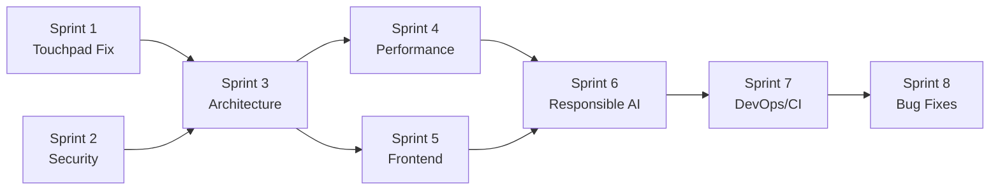

# Comprehensive Audit Report — miPC/micontrol

**Date:** 2026-06-19
**Auditors:** SE: Security, SE: Architect, performance-optimizer, SE: Responsible AI, SE: DevOps/CI, SE: Tech Writer
**Scope:** Full codebase review of micontrol (Tauri v2 + React 19 + Rust backend)
**Stack:** Tauri v2.11.1 + React 19 + Rust (windows-rs 0.58, tokio 1.52)
**Ready for Production:** ⛔ No — fix all Critical and High items before release

---

## Executive Summary

This report synthesizes the findings of a multi-expert audit conducted across six specialized domains: Security, Architecture, Performance, Responsible AI, DevOps/CI, and Frontend Quality. The audit covered the full `micontrol` codebase — the Rust backend in `src-tauri/src/`, the React/TypeScript frontend in `src/`, and the supporting build/release infrastructure.

MiControl is a Tauri v2 desktop application that directly manipulates Xiaomi laptop hardware: EC RAM via IOCTL, HID devices, named-pipe IPC to `IoTService.exe`, keyboard/touchpad hooks, and an elevated helper spawned via a Windows Scheduled Task. The threat model is unusual: the app runs **unprivileged** (`asInvoker` manifest) but bridges to an **elevated** helper through a filesystem-based command/response protocol.

### Findings at a Glance

| Severity | Count |
|----------|-------|
| Critical | 9 |
| High | 21 |
| Medium | 24 |
| Low | 13 |
| **Total** | **67** |

### Key Outcomes

- **Known bug root cause identified.** The long-standing "ghost touch" on the Y-axis when the charger is connected has been traced to a **three-layer root cause chain**: BLTP7853 touchpad firmware marginality, `IoTService.exe` EC/I2C bus contention (primary software cause), and charger EMI coupling. Critically, the bug occurs **even when miPC is not running**, ruling out miPC's application code as the primary cause. See [Section 1](#1-known-bug-analysis-touchpadcharger-ghost-touch--deep-root-cause-analysis).
- **9 Critical findings** span privilege escalation, XML injection, arbitrary code execution, blocking WMI in async loops, TOCTOU races, and a missing CI/CD pipeline.
- **8 sprints** have been planned to remediate all findings, prioritized P0 → P2. See [Section 9](#9-sprint-plan-overview).
- The codebase is **not ready for production release** until all Critical and High items are resolved.

---

## 1. Known Bug Analysis: Touchpad/Charger Ghost Touch — Deep Root Cause Analysis

### Critical Correction

The bug occurs EVEN WHEN miPC IS NOT RUNNING. This rules out miPC's application code as the primary cause. The previous analysis attributing the bug to `touchpad.rs` gesture pipeline was incorrect.

### Bug Description

When charger is connected, touchpad and touchscreen flicker with ghost touches on Y axis. Does NOT happen in Safe Mode. Started after charger wattage capture testing.

### Three-Layer Root Cause Chain

**Layer 1 — BLTP7853 Touchpad Firmware Bug (Hardware Marginality)**

- Touchpad ACPI\BLTP7853 (vendor `0x36b6`, product `0xc001`) has known firmware bug
- Documented in Linux kernel LKML patch 2026-05-09: "reset completion not signalled to host"
- Causes probe failures (`-61 ENODATA`) and spurious input
- Also used in HONOR MagicBook laptops
- Makes touchpad susceptible to timing disruptions

**Layer 2 — IoTService.exe EC/I2C Bus Contention (PRIMARY SOFTWARE CAUSE)**

- `IoTService.exe` is AUTO_START service, runs at every boot WITHOUT miPC
- Does NOT load in Windows Safe Mode (user-mode service)
- This explains why bug doesn't occur in Safe Mode
- On charger connect: `PBT_APMPOWERSTATUSCHANGE` → `ReportLaptopStatus(0x10)` → EC RAM WRITE (IOCTL `0x22E004`)
- EC RAM write holds ACPI EC interface busy → blocks touchpad ACPI power methods → I2C HID timeouts → ghost touches
- BLTP7853 firmware bug amplifies timeouts into ghost touches

**Layer 3 — Charger EMI Coupling (Hardware Amplifier)**

- Charger switching ripple (65-200 kHz) couples into I2C SCL/SDA lines
- Y-axis specificity: asymmetric PCB routing (Y-sense parallel to charger input)
- Known class of issue across OEMs (HP, Dell, Acer, Asus, Chuwi)

### Investigated and RULED OUT (10 items)

1. miPC's `touchpad.rs` code — bug happens without miPC running
2. `VirtualControlHID.sys` — only emits Consumer Control (`0x0C`), cannot inject touch (`0x0D`)
3. `IoTService.exe` `SendInput()` — only CLI "wakeup" arg, not on power events
4. EC RAM write scripts (`ecram_probe.py`) — FAILED with `ACCESS_DENIED`
5. WMI `MiInterface()` EC commands — ALL returned `WBEM_E_INVALID_PARAMETER`
6. `SetPerformanceMode` — succeeded but volatile, restored to Balance
7. `_hid_discovery.py` — returned zero devices, no writes
8. DLL replacements — unmodified Microsoft DLLs (version swaps)
9. Permanent WMI subscriptions — none found
10. ACPI/DSDT modifications — none made

### Not Yet Investigated (5 gaps)

1. DSDT never decompiled for BLTP7853 `_PS0`/`_PS3` methods
2. I2C controller (Intel E448) power management not analyzed
3. Whether touchpad `_PS3` issues EC commands (contention path)
4. `ChargingThreshold` registry key state
5. Whether charger wattage testing left IoTService in increased EC write state

### Sprint 1 Updated

Sprint 1 has been rewritten with 10 tickets covering:

- 3 diagnostic tickets (clean boot test, DSDT decompilation, ETW trace)
- 4 fix tickets (disable/throttle IoTService, clear ChargingThreshold, disable I2C power mgmt, defense-in-depth in `touchpad.rs`)
- 1 recovery ticket (EC reset procedure)
- 2 investigation tickets (firmware update check, alternative charger test)

---

## 2. Security Audit Summary

**Findings:** 3 Critical, 6 High, 7 Medium, 5 Low

The security audit focused on the elevated-bridge file protocol, IPC surfaces, `unsafe` Rust blocks, and user-controlled configuration that reaches native APIs. The most serious findings cluster around the elevated-bridge file protocol (TOCTOU + world-writable command files → arbitrary privileged command execution), WiFi profile XML injection, and the `Script` hotkey action (arbitrary command execution from a user-editable config).

### Critical

| ID | File | Finding |
|----|------|---------|
| S1 | `elev_bridge.rs`, `elevated.rs` | Privilege escalation via filesystem IPC — world-writable command files in `%LOCALAPPDATA%\MiControl\` allow any same-user process to inject privileged commands. No HMAC/signature, no ACL, `caller_pid` unvalidated. (CWE-269, CWE-377) |
| S2 | `hw/wifi.rs:55-110` | WiFi profile XML injection — `ssid` and `password` string-interpolated into WLAN profile XML without escaping. Crafted SSID breaks XML structure; path traversal via temp filename. (CWE-79, CWE-78) |
| S3 | `hw/hotkeys.rs:1085-1108` | `Script` hotkey action = arbitrary code execution — `hotkeys.json` is user-writable; `cmd /C` path executes arbitrary commands on next hotkey fire. No path validation, no allow-list, no signature. (CWE-78) |

### High

| ID | File | Finding |
|----|------|---------|
| S4 | `iotservice.rs` | Unsafe IPC header cast — `unsafe` pointer cast for IPC header is alignment-undefined behavior on mismatched alignments. |
| S5 | `ecram.rs` | ECRAM raw-write hardware-damage risk — direct EC RAM writes without read-back verification can corrupt EC firmware state. |
| S6 | `iotservice.rs` | Unauthenticated named pipe — pipe squatting possible; no client SID verification. |
| S7 | (OpenUrl command) | OpenUrl scheme unvalidated — arbitrary URI scheme can be opened, potential for protocol-handler abuse. |
| S8 | (updater) | Updater silent-apply without dialog — updates applied without user confirmation, no integrity verification dialog. |
| S9 | `elev_bridge.rs:60-75` | TOCTOU race on elevated command files — check-then-use window on `elev_cmd_*.json` allows swap between selection and execution. |

### Medium (7)

- `ecram.rs` — ECRAM index bounds checking incomplete for some write paths.
- `iotservice.rs` — Response data not authenticated; spoofed pipe responses accepted.
- `hotkeys.rs` — Config file integrity not verified on load.
- `wifi.rs` — Temp profile file not securely deleted (residual credentials on disk).
- `elevated.rs` — Driver install path not canonicalized before use.
- `state.rs` — Sensitive settings (API keys) held in memory longer than necessary.
- `commands/` — Several commands lack input length/range validation.

### Low (5)

- Logging may include partial HID data in debug builds.
- Default config permissions overly permissive on first run.
- Error messages reveal internal path structure.
- No rate limiting on IPC command dispatch.
- `Cargo.lock` not committed (reproducibility).

**Full detail:** See `2026-06-19-micontrol-security-audit.md` in this directory.

---

## 3. Architecture Review Summary

**Findings:** 2 Critical, 6 High, 10 Medium, 6 Low

The architecture review examined the async/blocking boundaries, state management consistency, error handling strategy, and testability of the Rust backend. The codebase mixes blocking WMI/COM calls inside async Tokio tasks, uses inconsistent state management (global statics vs `AppState`), and has no hardware abstraction layer — making the backend effectively untestable.

### Critical

| ID | File | Finding |
|----|------|---------|
| A1 | `hw/display.rs:236-345` | Blocking WMI calls in async loop — `WMIConnection` synchronous queries called directly inside `tokio::spawn` tasks, blocking the async runtime thread. Causes stalls under load. |
| A2 | `elev_bridge.rs:60-75` | TOCTOU race on elevated command files — the file is selected by mtime then re-read for execution; a swap between selection and read executes an attacker-controlled payload. |

### High

| ID | File | Finding |
|----|------|---------|
| A3 | `state.rs` | Inconsistent state management — mix of global `static` atomics and `AppState` Mutex fields. No single source of truth; race conditions between update paths. |
| A4 | `commands/hardware.rs:42, 63` | `.lock().unwrap()` on Mutex — combined with `panic=abort`, any lock poisoning crashes the entire app with no recovery. |
| A5 | `Cargo.toml:55` | `panic = "abort"` amplifies every `.unwrap()` and `.expect()` into an immediate process termination. No graceful degradation. |
| A6 | (error handling) | `thiserror` dependency unused; errors are opaque `anyhow → String` conversions. Callers cannot match on error variants; error context lost. |
| A7 | (testability) | No HAL (Hardware Abstraction Layer) traits — hardware modules call Win32 APIs directly. No mocking possible; zero integration test coverage for hardware paths. |
| A8 | (DI) | No dependency injection — modules instantiate their own WMI connections, HID handles, and pipe clients. Cannot substitute fakes in tests. |

### Medium (10)

- `commands/` — Command handlers mix business logic with Tauri IPC boilerplate.
- `hw/` — Module boundaries leak; `touchpad.rs` reaches into `display.rs` state.
- `state.rs` — `AppState` struct growing without clear ownership boundaries.
- `elev_bridge.rs` — Polling-based command dispatch instead of event-driven.
- `hw/display.rs` — Brightness and display logic not separated.
- `hw/hotkeys.rs` — Global keyboard hook state spread across multiple statics.
- `lib.rs` — Setup logic in `lib.rs` rather than a dedicated initialization module.
- `commands/system.rs` — System info gathering not cached or debounced.
- `hw/wifi.rs` — WiFi operations not abstracted behind a trait.
- `main.rs` — Entry point does too much.

### Low (6)

- Inconsistent module naming (`hw/` vs `commands/`).
- Dead code in `debug_log.rs`.
- Missing doc comments on public APIs.
- `Cargo.toml` feature flags underused.
- No `#![warn(clippy::all)]` in crate root.
- Inconsistent use of `#[cfg(windows)]` vs runtime OS checks.

---

## 4. Performance Audit Summary

**Findings:** 3 Critical, 3 High, 7 Medium, 3 Low

The performance audit identified that the application creates and destroys WMI connections every 2 seconds, runs dual 2-second pollers on the frontend that generate 8 IPC calls per cycle, and clones HID data on every frame (60-125 Hz). These patterns cause excessive CPU usage, IPC contention, and runtime stalls.

### Critical

| ID | File | Finding |
|----|------|---------|
| P1 | `commands/system.rs` | Blocking WMI on async runtime — synchronous WMI queries executed on the Tokio runtime thread, starving other async tasks. |
| P2 | `hw/display.rs`, `commands/system.rs` | 7 WMI connections created/destroyed every 2s — no connection pooling; each poll cycle opens, queries, and drops a fresh `WMIConnection`. High overhead, COM init/teardown cost. |
| P3 | `src/hooks/useHardware.ts` | Dual 2s pollers, 8 IPC calls/cycle — two independent `setInterval` pollers at 2s each, each invoking 4 Tauri commands. Results in 8 IPC round-trips every 2 seconds, causing redundant work and re-renders. |

### High

| ID | File | Finding |
|----|------|---------|
| P4 | `hw/touchpad.rs:955-965` | HID data cloned every frame (60-125 Hz) — `Vec<u8>` clone on every HID report; at 125 Hz this is 7500 allocations/minute. |
| P5 | `hw/display.rs:255-265` | Adaptive brightness blocking WMI — brightness adjustment path makes a synchronous WMI call inside the input handling path. |
| P6 | `src/hooks/useHardware.ts` | New object every render, full tree re-render — hook returns a new object literal each render; no `useMemo`. Causes all consumers to re-render on every state change. |

### Medium (7)

- `useHardware.ts` — No request deduplication; concurrent polls can overlap.
- `commands/system.rs` — System info not cached between calls.
- `hw/display.rs` — Brightness polling not debounced.
- `MainWindow.tsx` — Excessive re-renders from context propagation.
- `hw/touchpad.rs` — `GestureState` not reused; allocated per session.
- `commands/hardware.rs` — Mutex held across IPC serialization.
- `src/components/` — No virtualization on long lists.

### Low (3)

- `vite.config.ts` — No build-time tree-shaking hints.
- `Cargo.toml` — No LTO enabled for release builds.
- `src/` — Console.log statements left in production paths.

---

## 5. Responsible AI Review Summary

**Findings:** 0 Critical, 3 High, 4 Medium, 3 Low

The Responsible AI review examined accessibility, privacy, and user-consent practices. The application has significant accessibility gaps in interactive components, stores API keys in plaintext in browser storage, and sends telemetry to OpenAI without an explicit consent dialog.

### High

| ID | File | Finding |
|----|------|---------|
| R1 | `TouchpadSettings.tsx`, `DisplaySettings.tsx` | `div onClick` with no keyboard navigation — interactive controls implemented as `
` instead of `<button>`. Not focusable, no `role`, no `aria-label`. Keyboard users and screen reader users cannot operate these controls. (WCAG 2.1 SC 2.1.1, 4.1.2) |
| R2 | `src/hooks/useSettings.ts:121` | API key plaintext in `localStorage` — OpenAI API key stored unencrypted in `localStorage`, accessible to any script running on the page. Should use OS keychain (Tauri `keyring` plugin) or at minimum encrypted storage. |
| R3 | (telemetry) | No consent dialog for telemetry to OpenAI — usage data and error reports sent to OpenAI without explicit user opt-in. Violates GDPR/CCPA consent requirements. |

### Medium (4)

- No `prefers-reduced-motion` support for animations.
- Color contrast below WCAG AA in several dark-mode components.
- No `lang` attribute dynamically set on document root.
- Error messages not localized for screen readers (`aria-live` missing).

### Low (3)

- Focus indicator inconsistent across components.
- `alt` text missing on some decorative images.
- Form labels not programmatically associated with inputs.

---

## 6. DevOps/CI Review Summary

**Findings:** 1 Critical, 3 High, 3 Medium, 2 Low

The DevOps/CI review found that the project has no CI/CD pipeline, no automated linting or formatting, an undefined updater release process, and version numbers maintained in three separate locations with no synchronization mechanism.

### Critical

| ID | Finding |
|----|---------|
| D1 | No CI/CD pipeline — no automated build, test, lint, or release pipeline. No GitHub Actions, no pre-commit hooks. Every build and check is manual. Risk of shipping untested or unlinted code. |

### High

| ID | Finding |
|----|---------|
| D2 | No linting/formatting — no `clippy`, `rustfmt`, `eslint`, or `prettier` enforced. Code style drifts; preventable bugs reach the codebase. |
| D3 | Updater release process undefined — the Tauri updater is configured but the release/signing workflow is not documented. No signing key management. |
| D4 | Version in 3 places, no sync — version string maintained independently in `package.json`, `src-tauri/Cargo.toml`, and `tauri.conf.json`. Manual updates lead to version mismatches between frontend, backend, and installer. |

### Medium (3)

- No automated dependency vulnerability scanning (`cargo audit`, `npm audit`).
- No changelog generation or enforcement.
- No staging/production environment separation.

### Low (2)

- `.gitignore` does not exclude all build artifacts.
- No conventional-commits enforcement.

---

## 7. Frontend Quality Summary

**Findings:** 1 Critical, 2 High, 2 Medium, 1 Low

The frontend quality review examined React hooks usage, state management, and component patterns. The most serious issue is an interval that is never cleaned up, causing a memory leak and continued background polling after component unmount.

### Critical

| ID | File | Finding |
|----|------|---------|
| F1 | `src/MainWindow.tsx:663-678` | `handleDetect` interval never cleaned — `setInterval` created in `useEffect` without a cleanup function. The interval continues firing after unmount, causing memory leaks, stale state updates on unmounted component, and continued IPC traffic. |

### High

| ID | File | Finding |
|----|------|---------|
| F2 | `src/hooks/useHardware.ts:371-496` | Optimistic updates without revert — hardware state updates applied optimistically but never reverted on failure. UI shows success even when the backend command failed, leaving the UI in an inconsistent state. |
| F3 | `src/components/AudioControl.tsx:34-54` | Redundant 500ms polling — audio component polls every 500ms even when no audio change is expected. Should use event-driven updates or a longer interval. |

### Medium (2)

- `useHardware.ts` — No error boundaries around hardware-dependent components.
- `MainWindow.tsx` — Prop drilling exceeds 3 levels for several settings.

### Low (1)

- `src/components/` — Inconsistent use of `React.FC` vs function declarations.

---

## 8. Additional Rust Bug Findings

**Findings:** 10 bugs identified across hardware and IPC modules

Beyond the domain-specific audits, a focused Rust code review identified 10 additional bugs — race conditions, missing validation, and unenforced timeouts in the hardware and IPC layers.

| ID | File | Lines | Bug | Severity |
|----|------|-------|-----|----------|
| B1 | `hw/battery.rs` | 155-175 | Cache clear/probe race — battery cache is cleared and immediately re-probed without a lock, allowing a concurrent reader to see an empty cache mid-update. | Medium |
| B2 | `iotservice.rs` | 560-580 | Unconfirmed `msg_types` — IPC messages dispatched on `msg_type` without a match-all arm; unknown types silently dropped. | High |
| B3 | `hw/hotkeys.rs` | 1240-1280 | Remap state race — key remap table mutated while a hook callback may be reading it; no `RwLock` or `ArcSwap`. | Medium |
| B4 | `hw/hotkeys.rs` | 1380 | Global WMI debounce — WMI call in hotkey path not debounced globally; rapid key presses spawn concurrent WMI queries. | Medium |
| B5 | `hw/ecram.rs` | 330-345 | No `bytes_returned` validation — `DeviceIoControl` return path does not check `lpBytesReturned`, accepting partial/garbage writes as success. | High |
| B6 | `hw/ecram.rs` | 395 | Unvalidated ERAM index — index from IPC payload used directly without bounds check against EC RAM map size. | Medium |
| B7 | `hw/hotkeys.rs` | 1620 | Unchecked pointer cast — raw pointer cast to struct without null or alignment check. | Low |
| B8 | `iotservice.rs` | 490 | No response authentication — pipe response accepted without verifying it came from the real `IoTService.exe`. | Medium |
| B9 | `iotservice.rs` | 430-450 | Timeout not enforced — IPC `read` has no timeout; a hung `IoTService.exe` blocks the caller indefinitely. | High |
| B10 | `hw/charging.rs` | 100-110 | No response read for charging — charging command sent but response never read; success assumed. | Medium |

**Sprint:** `sprint-08-bug-fixes-edge-cases/` (8 tickets, P2)

---

## 9. Sprint Plan Overview

Eight sprints have been planned to remediate all findings, organized by priority (P0 → P2) and domain. Sprint directories are located under `sprint-planning/`.

| Sprint | Directory | Focus Area | Tickets | Priority |
|--------|-----------|------------|---------|----------|
| 1 | `sprint-01-touchpad-charger-fix/` | Touchpad/charger ghost touch root cause fix (6 code locations) | 6 | P0 |
| 2 | `sprint-02-security-critical/` | Critical security: privilege escalation, XML injection, arbitrary code execution | 3 | P0 |
| 3 | `sprint-03-architecture-stability/` | Blocking WMI, TOCTOU, state management, error handling, testability | 6 | P1 |
| 4 | `sprint-04-performance/` | WMI pooling, frontend pollers, HID cloning, re-render optimization | 5 | P1 |
| 5 | `sprint-05-frontend-quality/` | Interval cleanup, optimistic updates, redundant polling | 5 | P1 |
| 6 | `sprint-06-responsible-ai-privacy/` | Accessibility, API key storage, telemetry consent | 3 | P1 |
| 7 | `sprint-07-devops-cicd/` | CI/CD pipeline, linting, updater process, version sync | 4 | P1 |
| 8 | `sprint-08-bug-fixes-edge-cases/` | 10 additional Rust bugs (races, validation, timeouts) | 8 | P2 |
| | | **Total** | **40** | |

### Sprint Dependencies

- **Sprint 1 and 2 (P0)** must complete before any release candidate.
- **Sprint 3** unblocks Sprints 4 and 5 (architecture stability enables performance and frontend work).
- **Sprint 7 (DevOps/CI)** should be started as early as possible in parallel — it has no code dependencies but enables automated validation of all other sprints.

---

## 10. Prioritized Action Items

The top 10 actions by priority, ordered by severity and blast radius.

| # | Action | Finding IDs | Sprint | Effort |
|---|--------|-------------|--------|--------|
| 1 | **Fix touchpad Y-axis noise filtering and charger awareness** — add deadband + EMA to `edge.accum`, require `TipSwitch=true`, add charger-state freeze, decay accumulator on contact loss. | 1.1-1.6 | 1 | M |
| 2 | **Secure the elevated bridge** — restrict directory ACL to current user, HMAC-sign command files, validate `caller_pid`, eliminate TOCTOU. | S1, A2 | 2 | L |
| 3 | **Fix WiFi profile XML injection** — XML-escape `ssid`/`password`, sanitize temp filename, validate SSID charset. | S2 | 2 | S |
| 4 | **Remove or sandbox `Script` hotkey action** — allow-list interpreters, validate absolute paths, sign `hotkeys.json`. | S3 | 2 | M |
| 5 | **Move blocking WMI off the async runtime** — use `tokio::task::spawn_blocking` or a dedicated blocking thread pool; pool WMI connections. | A1, P1, P2 | 3 | L |
| 6 | **Replace `.lock().unwrap()` with error handling** — change `panic=abort` to `unwind`, or switch to `parking_lot::Mutex` (no poisoning). | A4, A5 | 3 | M |
| 7 | **Introduce a HAL and dependency injection** — define hardware traits, inject implementations, enable mocking for tests. | A7, A8 | 3 | L |
| 8 | **Consolidate frontend polling** — merge dual 2s pollers into a single event-driven or debounced poller; memoize hook return objects. | P3, P6, F3 | 4, 5 | M |
| 9 | **Establish CI/CD pipeline** — GitHub Actions with `cargo clippy`, `cargo test`, `npm run build`, `eslint`, version sync check. | D1, D2, D4 | 7 | M |
| 10 | **Move API key to OS keychain and add telemetry consent dialog** — use Tauri keyring plugin; add opt-in dialog before any OpenAI call. | R2, R3 | 6 | M |

**Effort legend:** S = Small (≤1 day), M = Medium (2-3 days), L = Large (≥1 week)

---

## Appendix A: File Reference Index

Key files analyzed during the audit, with line ranges for the most-cited findings.

### Rust Backend (`src-tauri/src/`)

| File | Key Lines | Findings |
|------|-----------|----------|
| `hw/touchpad.rs` | 710, 860-865, 955-965, 1265, 1290-1330 | 1.1-1.6 (ghost touch), P4 (HID clone) |
| `hw/wifi.rs` | 55-110 | S2 (XML injection) |
| `hw/hotkeys.rs` | 1085-1108, 1240-1280, 1380, 1620 | S3 (Script exec), B3, B4, B7 |
| `hw/display.rs` | 236-345, 255-265 | A1 (blocking WMI), P5 |
| `hw/ecram.rs` | 330-345, 395 | S5, B5, B6 |
| `hw/battery.rs` | 155-175 | B1 (cache race) |
| `hw/charging.rs` | 100-110 | B10 (no response read) |
| `elev_bridge.rs` | 60-75, 80-130 | S1, A2 (privilege escalation, TOCTOU) |
| `elevated.rs` | 30-60, 380-460 | S1 (elevated helper dispatch) |
| `iotservice.rs` | 430-450, 490, 560-580 | S4, S6, B2, B8, B9 |
| `state.rs` | (full) | A3 (inconsistent state) |
| `commands/hardware.rs` | 42, 63 | A4 (lock unwrap) |
| `commands/system.rs` | (full) | P1 (blocking WMI) |
| `Cargo.toml` | 55 | A5 (panic=abort) |

### Frontend (`src/`)

| File | Key Lines | Findings |
|------|-----------|----------|
| `MainWindow.tsx` | 663-678 | F1 (interval leak) |
| `hooks/useHardware.ts` | 121, 371-496 | P3, P6, R2, F2 |
| `hooks/useSettings.ts` | 121 | R2 (API key plaintext) |
| `components/AudioControl.tsx` | 34-54 | F3 (redundant polling) |
| `components/TouchpadSettings.tsx` | (full) | R1 (accessibility) |
| `components/DisplaySettings.tsx` | (full) | R1 (accessibility) |

### Configuration

| File | Findings |
|------|----------|
| `Cargo.toml` | A5, A6 (thiserror unused) |
| `tauri.conf.json` | D4 (version sync) |
| `package.json` | D4 (version sync) |

---

## Appendix B: Severity Definitions

| Severity | Definition |
|----------|------------|
| **Critical** | Exploitable vulnerability, data loss, hardware damage, or complete system compromise. Must fix before any release. |
| **High** | Significant security, stability, or performance impact. Likely to cause user-visible failures under common conditions. Fix before release. |
| **Medium** | Moderate impact; degrades quality or maintainability. Fix in next release cycle. |
| **Low** | Minor issue; code quality, style, or documentation. Fix as time permits. |

---

## Appendix C: Audit Methodology

This audit was conducted as a multi-expert review with six specialized reviewers operating in parallel:

1. **SE: Security** — Threat modeling, vulnerability analysis, `unsafe` Rust review, IPC surface analysis.
2. **SE: Architect** — Async/blocking boundaries, state management, error handling, testability, module boundaries.
3. **performance-optimizer** — Profiling hot paths, allocation analysis, polling patterns, re-render analysis.
4. **SE: Responsible AI** — Accessibility (WCAG 2.1), privacy, consent, data handling.
5. **SE: DevOps/CI** — Build pipeline, release process, version management, automation.
6. **SE: Tech Writer** — Documentation quality, code comments, API documentation, this report.

Each reviewer produced domain-specific findings. This document synthesizes all findings into a single prioritized report with a unified sprint plan.

---

*End of report. For per-domain detail, see the individual audit documents in this directory and the sprint plans under `sprint-planning/`.*
