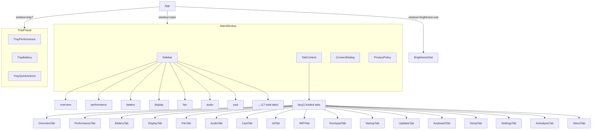
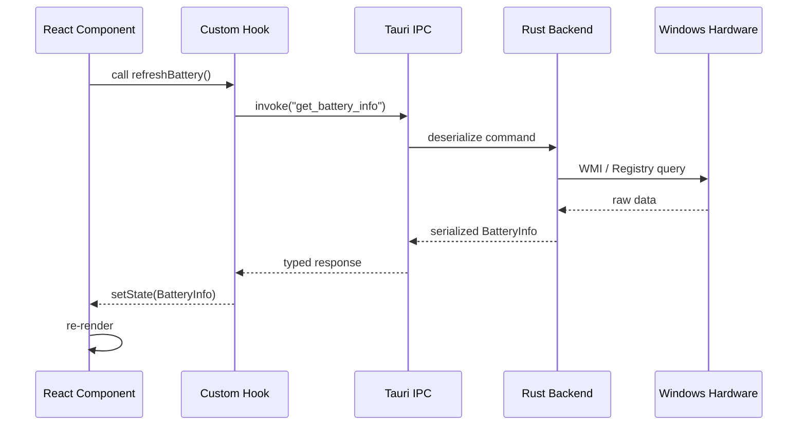
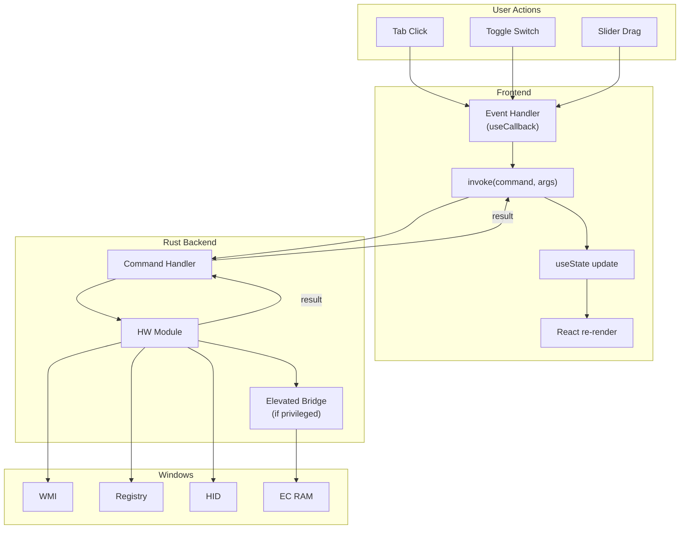

# Frontend Architecture

## Overview

miPC's frontend is built with **React 19**, **TypeScript**, and **Vite**, communicating with the Rust backend through **Tauri v2 IPC** (`invoke`). The UI is a single-window, tab-based application with a sidebar for navigation and lazy-loaded tab content.

---

## Technology Stack

| Layer        | Technology                    |
| ------------ | ----------------------------- |
| Framework    | React 19                      |
| Language     | TypeScript 5.8                |
| Bundler      | Vite 6                        |
| IPC          | @tauri-apps/api/core (invoke) |
| Styling      | Tailwind CSS + custom CSS     |
| i18n         | react-i18next                 |
| Testing      | Vitest + Testing Library      |
| Code Quality | ESLint, Prettier, TypeScript  |

---

## Component Hierarchy



### Key Components

| Component       | Path                               | Description                                   |
| --------------- | ---------------------------------- | --------------------------------------------- |
| `App`           | `src/App.tsx`                      | Root component; theme, Sentry, window routing |
| `MainWindow`    | `src/pages/MainWindow.tsx`         | Main app window with sidebar + tab content    |
| `TrayPopup`     | `src/pages/TrayPopup.tsx`          | System tray popup with quick controls         |
| `Sidebar`       | (inline in MainWindow)             | `React.memo`-optimized navigation sidebar     |
| `BrightnessOsd` | `src/components/BrightnessOsd.tsx` | On-screen brightness overlay                  |

---

## State Management

React built-in hooks are used throughout; there is no external state management library.

```mermaid
graph LR
    subgraph Hooks["Custom Hooks"]
        useHardware
        useI18n["useLanguage"]
        useSettings
        useAnalysisLogger
    end

    subgraph Context["Contexts"]
        ToastContext["ToastProvider"]
    end

    useHardware -->|invoke| RustCommands["Rust Commands"]
    useHardware -->|state| TabComponents["Tab Components"]
    useI18n -->|t()| AllComponents["All Components"]
    useSettings -->|persist| localStorage
    ToastContext -->|notifications| AllComponents
```

### Custom Hooks

| Hook                | File                             | Responsibility                                                                                                     |
| ------------------- | -------------------------------- | ------------------------------------------------------------------------------------------------------------------ |
| `useHardware`       | `src/hooks/useHardware.ts`       | Central hardware state (CPU, GPU, battery, fan, display, audio, touchpad, keyboard), refresh and error aggregation |
| `useLanguage`       | `src/hooks/useI18n.ts`           | i18n setup with react-i18next, locale switching                                                                    |
| `useSettings`       | `src/hooks/useSettings.ts`       | Persistent user preferences via localStorage                                                                       |
| `useAnalysisLogger` | `src/hooks/useAnalysisLogger.ts` | AI analysis event logging                                                                                          |

### Key Patterns

- **`useState` / `useEffect`** — Local component state and side effects (e.g., IPC calls on mount).
- **`useCallback`** — Memoized event handlers passed to child components.
- **`React.memo`** — Applied to `Sidebar` to prevent unnecessary re-renders on tab switches.
- **Lazy loading** — All tab pages use `React.lazy()` + `Suspense` for code splitting.

---

## Routing

miPC uses **tab-based navigation** driven by a `useState` string (no router library). The `MainWindow` component holds an `activeTab` state, and the `Sidebar` renders `NAV_ITEMS` as buttons. Clicking a tab updates `activeTab`, which conditionally renders the corresponding lazy-loaded page.

```typescript
const [activeTab, setActiveTab] = useState('overview');

// Sidebar button onClick → setActiveTab('battery')
// TabContent renders: <BatteryTab /> when activeTab === 'battery'
```

Window type is determined by a URL query parameter (`?window=main`, `?window=tray`, `?window=brightness-osd`) set by Tauri at window creation.

---

## Internationalization (i18n)

| Locale     | File               |
| ---------- | ------------------ |
| English    | `src/i18n/en.json` |
| Portuguese | `src/i18n/pt.json` |
| Spanish    | `src/i18n/es.json` |
| French     | `src/i18n/fr.json` |

- **Library**: `react-i18next`
- **Initialization**: `useLanguage` hook in `src/hooks/useI18n.ts`
- **Usage**: `t('nav.overview')` or `t('battery.chargeThreshold')`
- **Locale switching**: Stored in `localStorage`, detected from system locale on first launch

---

## IPC (Tauri invoke)

All communication with the Rust backend happens through `@tauri-apps/api/core`'s `invoke()` function. Each hardware domain has typed interfaces.



Type definitions are co-located in the hook files (e.g., `useHardware.ts` exports `BatteryInfo`, `FanInfo`, `DisplayInfo`, etc.) rather than a separate `types/` folder.

---

## Styling

- **Tailwind CSS** — Utility-first framework for rapid UI development.
- **Custom CSS** — Additional styles in `src/styles/` for theming, animations, and component-specific overrides.
- **Design Tokens** — CSS custom properties for colors, spacing, and typography. Theme switching (`light`/`dark`/`auto`) is driven by the `data-theme` attribute on `<html>`.
- **`prefers-reduced-motion`** — All animations respect the user's motion preferences.

---

## Data Flow



---

## Testing

| Tool                        | Usage                       |
| --------------------------- | --------------------------- |
| Vitest                      | Test runner                 |
| @testing-library/react      | Component testing           |
| @testing-library/user-event | User interaction simulation |
| jsdom                       | DOM environment             |

Tests are located in `src/__tests__/` and cover component rendering, user interactions, and i18n correctness.
