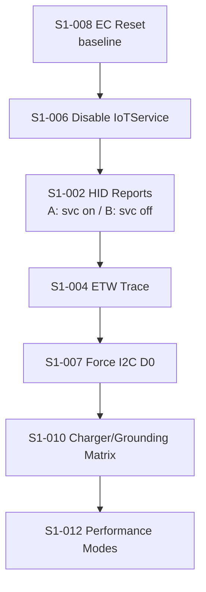

# Sprint 1 — Physical EMI Test Suite

Diagnostic scripts for the touchpad/charger ghost-touch bug (analog EMI coupling).
Each script prepares the system, captures logs for a set duration, and **reverts its
changes in a `finally` block** so the machine is always left clean.

## Prerequisites

| Requirement | Notes |
|-------------|-------|
| **Administrator PowerShell** | Every script starts with `#Requires -RunAsAdministrator`. Right-click PowerShell → *Run as Administrator*. |
| **Charger available** | The original Xiaomi charger (and optionally a 3rd-party / grounded one for S1-010). |
| **Windows Performance Toolkit (WPT)** | Optional, only for analyzing S1-004 `.etl` traces in WPA. Install via Windows ADK. |
| **miPC dev dependencies** | For `-WithMiPC` runs: `npm install` must have been run once in `micontrol/`. |
| **Total time** | ~3–4 hours including reboots. |

## Execution Order

Run the tickets in this order. S1-008 first establishes a clean EC baseline; the
rest build on it.



## How to Run Each Test

From an **elevated** PowerShell, `cd` into the ticket folder and run:

```powershell
cd .\S1-008-ec-reset
.\run-test.ps1                 # basic run
.\run-test.ps1 -WithMiPC       # also start miPC dev mode during capture
```

Common parameters (where applicable):

| Parameter | Meaning |
|-----------|---------|
| `-WithMiPC` | Start `npm run tauri dev` before the capture window, stop it after. |
| `-ResumeFrom "<Phase>"` | Used internally by the reboot-resume mechanism. You normally do **not** pass this manually. |

## What Each Script Produces

```
physical-tests/
├── logs/<TicketId>-<timestamp>.log          # human-readable test log
└── results/<TicketId>-<timestamp>/          # captures (ETW .etl, HID reports, snapshots)
```

## Reboot Handling

Scripts that require a reboot (S1-006, S1-007, S1-008) use a **RunOnce** registry
entry (`HKLM\...\RunOnce\MiPC_TestResume`) to re-launch themselves automatically
after reboot, passing `-ResumeFrom`. Original configuration values are persisted
to `.state/*.json` so the resume phase can revert them.

If a reboot-resume is interrupted, re-run the script with:

```powershell
.\run-test.ps1 -ResumeFrom "Cleanup"
```

## Cleanup Guarantee

Every script wraps its main logic so that **revert actions always run**, even on
Ctrl+C or unexpected errors. If you abort a test, re-run it with `-ResumeFrom Cleanup`
to ensure the system is restored.

## Ticket → Confirms Mapping

| Ticket | Title | What it confirms |
|--------|-------|------------------|
| **S1-008** | EC Reset | Establishes a clean EC baseline; rules out stale EC state. |
| **S1-006** | Disable IoTService | If ghost touches vanish with IoTService disabled → IoTService is an amplifier. |
| **S1-002** | HID Reports | Compares raw HID reports with IoTService running vs stopped; reveals COL04/COL05 vendor traffic. |
| **S1-004** | ETW Trace | Captures kernel-level I2C/HID/ACPI events; distinguishes I2C errors from analog corruption. |
| **S1-007** | Force I2C D0 | If forcing the I2C controller to stay in D0 removes ghost touches → D3hot idle is a factor. |
| **S1-010** | Charger/Grounding Matrix | Identifies which charger/outlet/grounding conditions trigger the bug. |
| **S1-012** | Performance Modes | Correlates TDP (Silence 16W / Balance 32W / Smart 60W) with ghost-touch frequency. |
