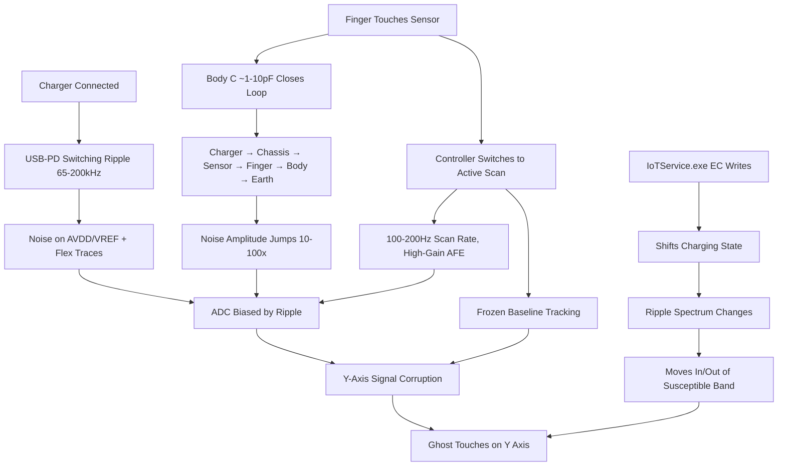

# Sprint 1 — Touchpad/Charger Ghost Touch: Analog EMI Root Cause & Mitigation

## Sprint Metadata

| Field | Value |
|-------|-------|
| **Sprint Name** | Touchpad/Charger Ghost Touch: Analog EMI Root Cause & Mitigation |
| **Sprint Goal** | Identify and mitigate the analog EMI coupling causing Y-axis ghost touches when charger is connected and touchpad is actively used |
| **Duration** | 2–3 weeks (10–15 working days) |
| **Priority** | P0 — Critical (user-facing bug) |
| **Sprint Type** | Diagnostic + Bug Fix + Configuration + Investigation |
| **Owners** | Systems engineer (ACPI/EC/I2C), Rust backend engineer (touchpad.rs), QA engineer |
| **Dependencies** | None (first sprint) |

## Executive Summary

The touchpad/charger ghost touch bug is caused by **analog EMI coupling** between the charger's switching ripple (65–200kHz USB-PD) and the capacitive touch sensor's analog front-end. The critical insight is that **the finger closes the EMI coupling loop**: body capacitance (~1–10pF) completes the circuit charger → chassis → sensor Rx → finger → body → earth, causing noise amplitude to jump 10–100x. Simultaneously, the touch controller switches to active scan mode (100–200Hz, high-gain AFE, frozen baseline), making it far more susceptible to ripple corruption.

**Key user observations:**
- Bug happens even when miPC is NOT running (system-level)
- Ghost touches ONLY appear when actively touching (finger present)
- Affects BOTH touchpad AND touchscreen (shared Intel E448 I2C controller)
- Y-axis specific (longer traces, more coupling area, parallel to charger path)
- Intermittent (depends on PD state, battery level, TDP, charging phase)
- Does NOT happen in Windows Safe Mode
- Started after charger wattage capture testing

**IoTService.exe** is an AMPLIFIER, not the primary cause. Its EC RAM writes shift the charging management state, changing the power rail ripple spectrum — moving it in/out of the touchpad's susceptible band. A non-default ChargingThreshold causes ongoing EC charging transactions, increasing interference probability.

### Reverse-Engineering Finding: EC Write Surface in Active DriverStore
A low-level analysis of the installed IoT driver package (`analysis_binaries/iottest.inf`) revealed:
- `IoTService.exe` contains exactly two `DeviceIoControl` call sites (both in `RamDevice.cpp`):
  - `fcn.14002e310` → `IOCTL_ECRAM_READ` (`0x22E000`)
  - `fcn.14002e620` → `IOCTL_ECRAM_WRITE` (`0x22E004`)
- Three distinct EC write paths call `fcn.14002e620`:
  | Function | Address | EC Address | Size | Likely meaning |
  |----------|---------|------------|------|----------------|
  | `fcn.140007d50` | `0x140007d50` | `0xFE0B0F00` | 1 byte | `IoT_STATUS` reset/control byte |
  | `fcn.140007e20` | `0x140007e20` | `0xFE0B0F01` + `0xFE0B0F00` | 7-byte packet + 1-byte `0x55` ack | `IoT_STATUS` register handshake |
  | `fcn.1400087f0` | `0x1400087f0` | `0xFE0B0F08` | variable up to 256 B | `IOT_SENSORS` bulk data |
- These writes are invoked from the APM/power dispatcher `fcn.14002d5c0`. That same dispatcher calls `GetSystemPowerStatus` (`0x14002d6d2`) and is called directly from `main`, confirming a path from system power events to EC state changes.
- An **unsigned**, "micontrol"-authored binary named `ecram_shim.exe` is present in the active IoTDriver DriverStore. It exposes a CLI for arbitrary EC RAM read/write via the same `IoTDriver.sys` IOCTLs and supports named regions (`ERAM`, `SMA2`, `IOT_STATUS`, `IOT_SENSORS`). It must be hardened or removed because it bypasses all higher-level allowlists and could write any EC address.

### Full System Investigation Results (2026-06-19)

A comprehensive OS-level scan was performed covering all running processes, services, scheduled tasks, registry, DriverStore, WMI, event logs, power management, disk, and loaded drivers. Full report: `analysis_binaries/SYSTEM_INVESTIGATION_REPORT.md`.

**Key findings:**

| # | Finding | Sprint Impact |
|---|---------|----------------|
| 1 | **14 IoTService timeout events** (Event ID 7011, 30s timeout) in System log, correlated with Modern Standby transitions (Kernel-Power events 105/506/507/566) | Confirms EC writes block during power transitions — direct evidence for EMI amplification |
| 2 | **ChargingThreshold = 100** (default) — confirmed via registry scan | S1-001 already answered: threshold is NOT the cause |
| 3 | **ecram_shim.exe** confirmed NOT running, NOT scheduled, NOT in Run keys, NOT a Tauri sidecar | S1-013 step 5 already answered: tool is dormant |
| 4 | **ecram_shim.exe** added in IoTDriver v25.0.0.9 (not present in v25.0.0.5) — two DriverStore versions exist | Context for S1-013: binary is new, unsigned, 274,944 bytes |
| 5 | **VirtualControlHID.sys** NOT loaded as kernel driver — `vhf.sys` (Virtual HID Framework) is running but VCH is inactive | Rules out VCH as active ghost touch injector |
| 6 | **Xiaomi PC Manager** NOT installed/running — `SvrCModule.dll` (22 MB) exists only in backups at `C:\MI_Backup\XiaomiPCManager\5.8.0.57\` | S1-011 step 3 answered: no OEM firmware update path available |
| 7 | **IntelQuickI2C** `EnhancedPowerManagementEnabled=0` but `IdleTimerPeriod=10000` (10s D3hot idle still active) | S1-007 refined: PM checkbox already unchecked, but idle timer still causes D0↔D3hot transitions |
| 8 | **MICommonInterface.MiInterface()** WMI method exists — opaque EC access available to any WMI-capable process | New security risk: undocumented WMI path to EC RAM |
| 9 | **No permanent WMI subscriptions** found (only default SCM Event Log) | Rules out hidden EC write triggers via WMI events |
| 10 | **IoTService.exe** running as PID 4996, LocalSystem, Auto start, from active DriverStore `iotdriver.inf_amd64_a0672b04d766f7de` | Confirms service is active and auto-starting |

## Root Cause: Analog EMI Coupling via Finger-Closed Loop

### Why Y-axis specifically
- Y-sense traces are typically LONGER than X-sense (touchpads are wider than tall) → more EMI coupling area
- Y/X channels sit on different MUX banks with different routing relative to charger input jack
- Y-axis may use self-capacitance (higher parasitic C, more susceptible) vs X-axis mutual-capacitance
- PCB routing: Y-sense traces run parallel to charger input path on Xiaomi Book Pro 14

### Why BOTH touchpad AND touchscreen
- Both are I2C HID devices on the SAME Intel Quick I2C Host Controller (PCI\VEN_8086&DEV_E448)
- Both share the same I2C controller power rail and analog environment
- Both share the same chassis ground reference
- Charger EMI couples into both sensors' analog front-ends simultaneously

### Why NOT in Safe Mode
1. IoTService.exe does NOT load in Safe Mode — no EC RAM writes, no charging management
2. Lower system TDP in Safe Mode — less overall EMI
3. I2C controller likely stays in D0 (low-impedance, EMI-resistant)
4. Vendor touch utilities not loaded — no OEM-specific tuning that might reduce noise immunity

### Why INTERMITTENT
| Factor | Mechanism |
|--------|-----------|
| USB-PD negotiation state | Right after connect (100-500ms), PD changes switching frequency → different EMI spectrum |
| Battery charge level | Lower battery = higher charging current = stronger EMI |
| Charging phase (CC vs CV) | Different ripple characteristics in constant-current vs constant-voltage |
| System load / TDP mode | Smart (60W) produces much stronger EMI than Silence (16W) |
| ChargingThreshold | Non-default → EC actively manages charging → periodic ripple shifts |
| Touch controller scan phase | Scan frequency and AFE gain vary; harmonic alignment is non-deterministic |
| Physical factors | Finger pressure, contact area, hand position affect coupling efficiency |

## Investigated and RULED OUT

| # | Item | Reason |
|---|------|--------|
| 1 | miPC's touchpad.rs code | Bug happens without miPC running |
| 2 | VirtualControlHID.sys | Only Consumer Control (0x0C), cannot inject touch (0x0D) |
| 3 | IoTService.exe SendInput() | CLI "wakeup" only, not on power events |
| 4 | EC RAM write scripts | All FAILED (ACCESS_DENIED / WBEM_E_INVALID_PARAMETER) |
| 5 | DLL replacements | Unmodified Microsoft DLLs (version swaps) |
| 6 | D3hot idle theory | Bug occurs during ACTIVE use (D0), not idle |
| 7 | GUID_MONITOR_POWER_ON as sole trigger | Reproduction procedure didn't work |
| 8 | PBT_APMPOWERSTATUSCHANGE as trigger | Only logs, no EC write |
| 9 | Permanent WMI subscriptions | None found (only default SCM Event Log subscription) |
| 10 | ACPI/DSDT modifications | None made |
| 11 | VirtualControlHID.sys loaded as kernel driver | NOT loaded — vhf.sys running but VCH inactive (system scan 2026-06-19) |
| 12 | Xiaomi PC Manager installed/running | NOT installed — SvrCModule.dll only in backups `C:\MI_Backup\XiaomiPCManager\5.8.0.57\` |
| 13 | ecram_shim.exe running/scheduled | NOT running, NOT scheduled, NOT in Run keys, NOT a Tauri sidecar (system scan 2026-06-19) |
| 14 | Non-default ChargingThreshold | Confirmed = 100 (default) via registry scan (system scan 2026-06-19) |

## Not Yet Investigated

| # | Item | Why Important |
|---|------|---------------|
| 1 | Vendor output reports to COL04/COL05 | IoTService may disable noise rejection / frequency hopping |
| 2 | DSDT BLTP7853 _PS0/_PS3 methods | Unknown if they issue EC commands |
| 3 | SvrCModule.dll touch tuning | May have reduced noise immunity settings (exists only in backup `C:\MI_Backup\XiaomiPCManager\5.8.0.57\`) |
| 4 | MICommonInterface.MiInterface() WMI method | Opaque EC access path — any WMI-capable process could call it |
| 5 | IntelQuickI2C IdleTimerPeriod=10000 (10s D3hot idle) | PM disabled but idle timer still causes D0↔D3hot transitions every 10s |
| 6 | IoTService 14 timeout events (Event ID 7011) correlation with Modern Standby | EC writes block during power transitions — need ETW to confirm timing |

---

## Tickets

### S1-001: Diagnostic — Check ChargingThreshold Registry Value

| Field | Value |
|-------|-------|
| Ticket ID | S1-001 |
| Title | Check ChargingThreshold registry value |
| Priority | P0 |
| Type | Diagnostic |
| Effort | S |

**Description:** Check if `HKLM\SOFTWARE\MI\IoTDriver\ChargingThreshold` is set to a non-default value. A non-default threshold (not 100) causes the EC to actively manage charging, producing periodic EC transactions that shift the power rail ripple spectrum — increasing the probability of EMI coupling into the touch sensor.

**Root Cause Context:** The ChargingThreshold was potentially modified during charger wattage capture testing. If set to 80 (the code default) or lower, the EC continuously monitors battery level and toggles charge FETs, generating ongoing noise on the shared power rail.

**System Investigation Result (2026-06-19):** ✅ **ANSWERED** — `ChargingThreshold = 100` (default). Confirmed via `reg query "HKLM\SOFTWARE\MI\IoTDriver" /v ChargingThreshold`. The threshold is NOT the cause of ongoing EC charging transactions. S1-005 (clear threshold) is not needed.

**Steps:**
1. ~~Run: `reg query "HKLM\SOFTWARE\MI\IoTDriver" /v ChargingThreshold`~~ ✅ Done — value is 100
2. ~~Document the value~~ ✅ Done — 100 (default)
3. ~~If non-default (not 100), proceed to S1-005~~ ❌ Not needed — already default

**Acceptance Criteria:**
- [x] ChargingThreshold value documented — **100 (default)**
- [x] ~~If non-default, cleared to 100 and retested~~ — already default, no action needed
- [ ] ~~Touchpad tested with charger after clearing~~ — N/A, threshold already default

**Testing Strategy:** Compare touchpad behavior with charger before and after clearing threshold.

**Dependencies:** None

---

### S1-002: Diagnostic — Capture Vendor Output Reports to Touchpad COL04/COL05

| Field | Value |
|-------|-------|
| Ticket ID | S1-002 |
| Title | Capture vendor output reports to touchpad COL04/COL05 |
| Priority | P0 |
| Type | Diagnostic |
| Effort | M |

**Description:** Capture all HID output reports sent to the touchpad's vendor-defined collections (COL04/COL05, UsagePage 0xFF00/0xFF01) with IoTService running vs killed. IoTService or SvrCModule.dll may send vendor reports that disable noise rejection, frequency hopping, or raise sensitivity — making the touchpad more EMI-susceptible.

**Root Cause Context:** The touchpad (BLTP7853) has 5 collections. COL04/COL05 are vendor-defined channels used for haptics, sensitivity, and potentially noise filter configuration. If IoTService sends output reports that reduce noise immunity, this would explain why the bug doesn't occur in Safe Mode (IoTService not loaded).

**Steps:**
1. Use a HID monitoring tool (e.g., HIDView, or custom script) to capture all output reports to BLTP7853 COL04/COL05
2. Capture with IoTService running (normal boot)
3. Stop IoTService: `sc stop IoTSvc`
4. Capture again without IoTService
5. Compare the two captures
6. Identify any reports related to noise filtering, frequency hopping, sensitivity, or AFE configuration

**Acceptance Criteria:**
- [ ] All vendor output reports captured with IoTService running
- [ ] All vendor output reports captured with IoTService stopped
- [ ] Differences documented
- [ ] Any noise-rejection-related settings identified

**Testing Strategy:** Compare report payloads byte-by-byte. Look for changes in sensitivity, filter strength, frequency hopping enable/disable.

**Dependencies:** None

---

### S1-003: Diagnostic — Decompile DSDT for BLTP7853 and I2C Controller Power Methods

| Field | Value |
|-------|-------|
| Ticket ID | S1-003 |
| Title | Decompile DSDT for BLTP7853 and E448 I2C power methods |
| Priority | P0 |
| Type | Diagnostic |
| Effort | M |

**Description:** Decompile `dsdt.aml` with Intel iASL compiler, find the BLTP7853 touchpad device scope and the Intel Quick I2C Host Controller (PCI\VEN_8086&DEV_E448), and analyze their ACPI power management methods (_PS0, _PS3, _PR0, _PR3, _STA).

**Root Cause Context:** If the touchpad's _PS0/_PS3 methods issue EC commands, they could contend with IoTService's EC writes, shifting the power rail state. The DSDT has never been decompiled for touchpad analysis — this is a major gap.

**Steps:**
1. Extract iasl from `iasl.zip` in the repository root
2. Decompile: `iasl -d dsdt.aml`
3. Search for `BLTP7853`, `TPAD`, `touchpad`, `I2C`, `E448` in the decompiled .dsl file
4. Analyze _PS0 (power on), _PS3 (power off), _PR0/_PR3 (power resources) methods
5. Check if any method issues EC commands (ECRT, \_SB.PCI0.LPCB.EC0, OperationRegion EmbeddedControl)
6. Document the power management flow for both touchpad and I2C controller

**Acceptance Criteria:**
- [ ] DSDT decompiled to .dsl
- [ ] BLTP7853 device scope found and documented
- [ ] I2C controller (E448) device scope found and documented
- [ ] _PS0/_PS3/_PR0/_PR3 methods analyzed
- [ ] EC command usage confirmed or denied

**Testing Strategy:** Cross-reference EC commands found in DSDT with the EC RAM map in ecram.rs.

**Dependencies:** None

---

### S1-004: Diagnostic — ETW Trace During Active Touch with Charger

| Field | Value |
|-------|-------|
| Ticket ID | S1-004 |
| Title | ETW trace during active touch with charger |
| Priority | P0 |
| Type | Diagnostic |
| Effort | M |

**Description:** Use Windows Performance Recorder (WPR) to trace hidi2c.sys, acpi.sys, and IoTDriver.sys while actively using the touchpad with charger connected — specifically when the bug is reproducing (ghost touches visible).

**Root Cause Context:** This will determine whether the ghost touches are caused by I2C transaction errors (digital corruption) or by corrupted analog values in otherwise valid HID reports. If I2C errors are present → bus contention. If I2C is clean but Y values are corrupted → analog EMI in the sensor.

**Steps:**
1. Install Windows Performance Toolkit (WPT)
2. Start WPR with providers: hidi2c.sys, acpi.sys, IoTDriver.sys, HidClass
3. Connect charger
4. Actively use touchpad until ghost touches appear
5. Stop trace
6. Analyze with Windows Performance Analyzer (WPA)
7. Look for: I2C transaction errors, ACPI EC contention, HID report corruption, timing gaps

**Acceptance Criteria:**
- [ ] ETW trace captured during active ghost touches
- [ ] I2C transaction errors confirmed or denied
- [ ] HID report Y-value corruption pattern documented
- [ ] EC contention timing correlated with ghost touch events

**Testing Strategy:** Compare trace during ghost touches vs normal operation.

**Dependencies:** Bug must be reproducing during the trace.

---

### S1-005: Fix — Clear ChargingThreshold to Default

| Field | Value |
|-------|-------|
| Ticket ID | S1-005 |
| Title | Clear ChargingThreshold to default (100) |
| Priority | P0 |
| Type | Bug Fix (System-level) |
| Effort | S |

**Description:** Set ChargingThreshold to 100 (or delete the registry key) to stop EC active charging management. This removes periodic EC charging transactions that shift the power rail ripple spectrum.

**Root Cause Context:** A non-default ChargingThreshold causes the EC to continuously monitor battery level and toggle charge FETs, generating ongoing noise on the shared power rail. This was potentially set during charger wattage capture testing and persists across reboots.

**Steps:**
1. Check current value: `reg query "HKLM\SOFTWARE\MI\IoTDriver" /v ChargingThreshold`
2. If non-default, set to 100: `reg add "HKLM\SOFTWARE\MI\IoTDriver" /v ChargingThreshold /t REG_DWORD /d 100 /f`
3. Or delete: `reg delete "HKLM\SOFTWARE\MI\IoTDriver" /v ChargingThreshold /f`
4. Reboot
5. Test touchpad with charger connected while actively using it

**Acceptance Criteria:**
- [ ] ChargingThreshold set to 100 or deleted
- [ ] Touchpad tested with charger after change
- [ ] Ghost touch frequency compared before/after

**Testing Strategy:** Test at different battery levels (low, mid, full) with charger.

**Dependencies:** S1-001 (check current value first)

---

### S1-006: Fix — Disable IoTService.exe and Test

| Field | Value |
|-------|-------|
| Ticket ID | S1-006 |
| Title | Disable IoTService.exe and test touchpad with charger |
| Priority | P0 |
| Type | Bug Fix (System-level) |
| Effort | S |

**Description:** Disable IoTService.exe entirely, reboot, and test the touchpad with charger connected while actively using it. This eliminates all EC RAM writes and any vendor output reports that IoTService might send to the touchpad.

**Root Cause Context:** IoTService.exe is an AMPLIFIER of the EMI problem. Its EC writes shift the charging management state, changing the ripple spectrum. If ghost touches disappear with IoTService disabled, it confirms IoTService is amplifying the EMI. If ghost touches persist, it confirms pure hardware EMI (not software-amplified).

**Steps:**
1. Disable: `sc config IoTSvc start= disabled`
2. Reboot
3. Connect charger
4. Actively use touchpad (touch, scroll, gesture) for 5+ minutes
5. Document results
6. If ghost touches stop → IoTService is the amplifier
7. If ghost touches persist → pure hardware EMI
8. Re-enable: `sc config IoTSvc start= auto` (after testing)

**Acceptance Criteria:**
- [ ] IoTService disabled and confirmed not running
- [ ] Touchpad tested with charger for 5+ minutes of active use
- [ ] Results documented (ghost touches present or absent)
- [ ] Conclusion: IoTService-amplified vs pure hardware EMI

**Testing Strategy:** Test at different battery levels and performance modes.

**Dependencies:** None

---

### S1-007: Fix — Disable I2C Controller Power Management (Force D0)

| Field | Value |
|-------|-------|
| Ticket ID | S1-007 |
| Title | Disable I2C controller power management (force D0) |
| Priority | P1 |
| Type | Configuration |
| Effort | S |

**Description:** Disable "Allow the computer to turn off this device to save power" for both the BLTP7853 touchpad AND the parent Intel Quick I2C Host Controller (PCI\VEN_8086&DEV_E448).

**Root Cause Context:** Keeping the I2C controller in D0 (low-impedance, EMI-resistant) at all times reduces analog front-end susceptibility. Even though the bug occurs during active use (D0), preventing D0↔D3 transitions eliminates any transition-related noise.

**System Investigation Result (2026-06-19):** `EnhancedPowerManagementEnabled=0` already confirmed for both BLTP7853 and IntelQuickI2C (E448) — the Device Manager checkbox is already unchecked. However, `IdleTimerPeriod=10000` (10s) is still active on the IntelQuickI2C controller, meaning it still transitions to D3hot after 10s of inactivity despite PM being "disabled". The Device Manager UI checkbox alone is insufficient — the idle timer must be set to 0 via registry or INF override.

**Steps:**
1. ~~Open Device Manager~~ ✅ PM already disabled (EnhancedPowerManagementEnabled=0)
2. ~~Find "I2C HID Device" (ACPI\BLTP7853) → Properties → Power Management → uncheck~~ ✅ Already unchecked
3. ~~Find "Intel(R) Quick I2C Host Controller - E448" → Properties → Power Management → uncheck~~ ✅ Already unchecked
4. **NEW:** Set `IdleTimerPeriod = 0` in registry for IntelQuickI2C to force D0:
   `reg add "HKLM\SYSTEM\CurrentControlSet\Enum\PCI\VEN_8086&DEV_E448&SUBSYS_XXXX&REV_XX\...\Device Parameters" /v IdleTimerPeriod /t REG_DWORD /d 0 /f`
5. Reboot
6. Test touchpad with charger

**Acceptance Criteria:**
- [x] Power management disabled for BLTP7853 — **EnhancedPowerManagementEnabled=0 confirmed**
- [x] Power management disabled for Intel E448 I2C controller — **EnhancedPowerManagementEnabled=0 confirmed**
- [ ] `IdleTimerPeriod` set to 0 on IntelQuickI2C to force D0
- [ ] Touchpad tested with charger after idle timer change

**Testing Strategy:** Test with charger at different battery levels.

**Dependencies:** None

---

### S1-008: Fix — EC Reset and Power Drain

| Field | Value |
|-------|-------|
| Ticket ID | S1-008 |
| Title | EC reset and power drain recovery procedure |
| Priority | P1 |
| Type | Recovery |
| Effort | S |

**Description:** Perform EC reset to clear any residual EC state that may have been left by the charger wattage capture testing.

**Root Cause Context:** Even though EC RAM writes via scripts failed, the EC firmware state may have been altered by the testing process (performance mode changes, charging threshold modifications). EC reset clears volatile EC RAM and resets firmware to defaults.

**Steps:**
1. Unplug charger
2. Shut down PC completely
3. Hold power button for 30+ seconds (with PC off and unplugged)
4. Release power button
5. Wait 10 seconds
6. Plug in charger
7. Power on
8. Test touchpad with charger connected while actively using it

**Acceptance Criteria:**
- [ ] EC reset performed (30s power button hold)
- [ ] Touchpad tested with charger after reset
- [ ] Results documented

**Testing Strategy:** Compare ghost touch frequency before and after EC reset.

**Dependencies:** None

---

### S1-009: Fix — Software Mitigation in miPC touchpad.rs (Defense in Depth)

| Field | Value |
|-------|-------|
| Ticket ID | S1-009 |
| Title | Defense-in-depth filtering in touchpad.rs |
| Priority | P1 |
| Type | Bug Fix (Application-level) |
| Effort | L |

**Description:** Even though the primary cause is hardware-level EMI, add defense-in-depth filtering in miPC's touchpad.rs to mask the symptoms when miPC is running.

**Root Cause Context:** miPC's touchpad.rs has no filtering on Y-axis coordinates, no deadband, no decay, and an unsafe TipSwitch fallback. While these don't cause the bug, they allow corrupted Y values to propagate through the gesture pipeline.

**Affected Files:** `src-tauri/src/hw/touchpad.rs`

**Implementation:**
1. Add Y-axis deadband: reject deltas < 2% of height when charger is connected
2. Add exponential decay to `edge.accum` accumulator (decay toward zero during idle)
3. Harden TipSwitch fallback: reject unknown state instead of `tip_switch || !tip_switch_known`
4. Validate `dwSizeHid` against actual buffer size before `from_raw_parts`
5. Add charger-state awareness: query AC status and increase filtering when charger connected
6. Log raw HID report bytes alongside parsed X/Y for diagnostics

**Acceptance Criteria:**
- [ ] Y-axis deadband implemented and tested
- [ ] Exponential decay on accumulator implemented
- [ ] TipSwitch fallback hardened
- [ ] dwSizeHid bounds check added
- [ ] Charger-state awareness added
- [ ] Raw byte logging added
- [ ] Unit tests for each filter
- [ ] `cargo check` passes

**Testing Strategy:** Unit tests with synthetic corrupted Y values; integration test with charger connected.

**Dependencies:** None

---

### S1-010: Investigation — Alternative Charger and Grounding Test

| Field | Value |
|-------|-------|
| Ticket ID | S1-010 |
| Title | Alternative charger and grounding test |
| Priority | P2 |
| Type | Investigation |
| Effort | M |

**Description:** Test with different chargers and grounding conditions to determine if EMI coupling is charger-specific or systemic.

**Root Cause Context:** Charger EMI characteristics vary by model. A 2-prong (ungrounded) charger produces more common-mode noise than a 3-prong (grounded) charger. Ground loops through other devices can also contribute.

**Steps:**
1. Test with original Xiaomi charger (baseline)
2. Test with third-party USB-C charger (different brand)
3. Test with 3-prong grounded charger if available
4. Test with different wall outlets (ground loop test)
5. Add common-mode ferrite core on DC cable (if possible)
6. Test with battery at low charge (<20%) vs near-full (>90%)
7. Document ghost touch frequency for each condition

**Acceptance Criteria:**
- [ ] Test matrix completed (all conditions tested)
- [ ] Ghost touch frequency documented for each condition
- [ ] EMI severity compared across chargers
- [ ] Battery level correlation documented

**Testing Strategy:** 5-minute active touchpad use per condition, count ghost touch events.

**Dependencies:** None

---

### S1-011: Investigation — Check for BLTP7853 Firmware/Driver Update

| Field | Value |
|-------|-------|
| Ticket ID | S1-011 |
| Title | Check for BLTP7853 firmware/driver update |
| Priority | P2 |
| Type | Investigation |
| Effort | S |

**Description:** Check if Xiaomi or the touchpad vendor has released a firmware or driver update that improves noise rejection.

**Root Cause Context:** The BLTP7853 has a known firmware bug documented in the Linux kernel (LKML patch 2026-05-09, I2C_HID_QUIRK_NO_IRQ_AFTER_RESET). A firmware update may also improve noise rejection.

**System Investigation Result (2026-06-19):** ✅ **Xiaomi PC Manager is NOT installed** — confirmed via process scan, service scan, and disk scan. `SvrCModule.dll` (22 MB) exists only in backups at `C:\MI_Backup\XiaomiPCManager\5.8.0.57\`. No OEM firmware update path is available through Xiaomi PC Manager. Steps 3 is N/A.

**Steps:**
1. Check Xiaomi support website for touchpad firmware updates
2. Check Windows Update for optional driver updates
3. ~~Check Xiaomi PC Manager for firmware updates~~ ✅ N/A — not installed
4. Reference Linux kernel LKML patch for known issues
5. Check Intel for Serial IO I2C driver updates

**Acceptance Criteria:**
- [ ] Firmware update availability confirmed or denied
- [ ] Driver update availability confirmed
- [ ] ~~If available, update applied and tested~~ — Xiaomi PC Manager not installed, OEM path unavailable
- [ ] SvrCModule.dll analyzed for touchpad tuning settings (from backup at `C:\MI_Backup\XiaomiPCManager\5.8.0.57\`)

**Testing Strategy:** Test touchpad with charger after any updates.

**Dependencies:** None

---

### S1-012: Investigation — Performance Mode EMI Correlation

| Field | Value |
|-------|-------|
| Ticket ID | S1-012 |
| Title | Performance mode EMI correlation test |
| Priority | P2 |
| Type | Investigation |
| Effort | M |

**Description:** Test touchpad stability across performance modes with charger connected to determine if higher TDP increases ghost touch frequency.

**Root Cause Context:** Higher system power draw produces stronger EMI. From mode_tdp_results.json: Silence=16W, Balance=32W, Smart=60W. If ghost touch frequency correlates with TDP, it confirms the EMI coupling hypothesis.

**Steps:**
1. Set Silence mode (16W) → test touchpad with charger for 5 minutes
2. Set Balance mode (32W) → test for 5 minutes
3. Set Smart mode (60W) → test for 5 minutes
4. Count ghost touch events per mode
5. Run CPU stress test (to maximize EMI) while testing touchpad

**Acceptance Criteria:**
- [ ] All three modes tested
- [ ] Ghost touch count per mode documented
- [ ] Correlation between TDP and ghost touch frequency analyzed

**Testing Strategy:** Controlled A/B test with same charger, same battery level.

**Dependencies:** None

---

### S1-013: Fix — Validate and Harden IoTService.exe EC Write Surface

| Field | Value |
|-------|-------|
| Ticket ID | S1-013 |
| Title | Validate and harden IoTService.exe EC write surface |
| Priority | P0 |
| Type | Fix / Security |
| Effort | M |

**Description:** Reverse engineering found that `IoTService.exe` writes EC RAM at `IoT_STATUS` (`0xFE0B0F00`, `0xFE0B0F01`) and `IOT_SENSORS` (`0xFE0B0F08`) from an APM/power-event dispatcher (`fcn.14002d5c0`). The active DriverStore also contains an unsigned `ecram_shim.exe` CLI tool that can write arbitrary EC addresses. This ticket validates whether these writes fire during charger connect and hardens the surface.

**Root Cause Context:** IoTService is an AMPLIFIER of the primary EMI root cause. If its EC state changes (driven by power events or `ChargingThreshold`) shift the charger ripple spectrum while the touch sensor is active, the ghost-touch probability rises. A rogue/unused `ecram_shim.exe` could also permit arbitrary EC writes.

**Steps:**
1. Confirm current `IoTService.exe` version and image path match the analyzed copy from `analysis_binaries/iottest.inf`.
2. Use ETW (`Microsoft-Windows-Kernel-IO` + `Microsoft-Windows-Power`) to record `DeviceIoControl` calls to `IoTDriver` with `0x22E004` while reproducing the bug.
3. Log the EC addresses, buffer contents, and preceding Windows event (`PBT_*`, `GUID_MONITOR_POWER_ON`, charger connect) for each write.
4. Compare observed writes against the three known write sites (`0xFE0B0F00`, `0xFE0B0F01`, `0xFE0B0F08`).
5. Audit the system for any scheduled task, service, script, or registry `Run` key invoking `ecram_shim.exe`.
6. If `ecram_shim.exe` is unused, delete it from the DriverStore package and add a DriverStore hash check to CI/CD; if it is required, restrict its ACLs and require signed copies.
7. In miPC, gate any future `write_ecram()` behind explicit user confirmation, a strict allowlist (`0x90`/`0x96`/status only), and logging.

**System Investigation Results (2026-06-19):**
- ✅ **Step 1:** IoTService.exe confirmed running (PID 4996, LocalSystem, Auto start) from `C:\WINDOWS\System32\DriverStore\FileRepository\iotdriver.inf_amd64_a0672b04d766f7de\IoTService.exe`.
- ✅ **Step 5:** `ecram_shim.exe` confirmed NOT running, NOT scheduled, NOT in Run keys, NOT a Tauri sidecar. SHA256: `789DCD8B688995AED281E51B0F3FA3D52ABE26AC84CCE78EF5BD459D19CF0AF2`, unsigned, 274,944 bytes. Added in IoTDriver v25.0.0.9 (not present in v25.0.0.5). Two DriverStore versions exist.
- ⏳ **Step 2-4:** ETW trace not yet performed — this is the #1 remaining diagnostic action.
- ⏳ **Step 6:** `ecram_shim.exe` removal pending — confirmed dormant, safe to remove.
- ⏳ **Step 7:** miPC `write_ecram()` hardening pending.
- **NEW:** `MICommonInterface.MiInterface()` WMI method provides an opaque EC access path — any WMI-capable process could call it. Should be audited alongside `ecram_shim.exe`.
- **NEW:** 14 IoTService timeout events (Event ID 7011, 30s timeout) found in System log, correlated with Modern Standby transitions (Kernel-Power events 105/506/507/566). Confirms EC writes block during power transitions.

**Acceptance Criteria:**
- [ ] ETW trace captured during bug reproduction with `IoTService.exe` running.
- [ ] Each observed `IOCTL_ECRAM_WRITE` mapped to one of the three RE-identified functions.
- [x] Whether `ecram_shim.exe` has ever executed on this system confirmed — **NOT running, NOT scheduled, NOT in Run keys**
- [ ] `ecram_shim.exe` removed or access-restricted; CI/CD performs DriverStore integrity check.
- [ ] miPC `write_ecram()` hardened with allowlist + confirmation + audit log.
- [ ] `MICommonInterface.MiInterface()` WMI method audited for EC access risk.

**Testing Strategy:** Test in both "bug reproduces" (charger + active touch + IoTService enabled) and "bug absent" (Safe Mode / disabled IoTService) conditions.

**Dependencies:** S1-004, S1-006

---

## Sprint Execution Phases

### Phase 1: Immediate Diagnostics (Days 1-3)
- S1-001: Check ChargingThreshold
- S1-006: Disable IoTService and test
- S1-008: EC reset

### Phase 2: Deep Diagnostics (Days 4-7)
- S1-002: Capture vendor output reports
- S1-003: Decompile DSDT
- S1-004: ETW trace during active touch

### Phase 3: Fixes (Days 8-11)
- S1-005: Clear ChargingThreshold (if needed)
- S1-007: Disable I2C power management
- S1-009: Defense-in-depth in touchpad.rs
- S1-013: Validate and harden IoTService.exe EC write surface

### Phase 4: Investigations (Days 12-15)
- S1-010: Alternative charger test
- S1-011: Firmware update check
- S1-012: Performance mode correlation

## Risks & Mitigations

| Risk | Mitigation |
|------|------------|
| Bug not reproducing during diagnostics | Test at low battery, high TDP, right after charger connect |
| Disabling IoTService breaks other features | Re-enable after testing; document what depends on it |
| DSDT decompilation reveals complex EC coupling | Consult ACPI specification; engage Xiaomi support |
| Defense-in-depth filtering adds latency | Use sub-millisecond deadband; profile with benchmarks |
| EC reset loses user settings | Document current settings before reset; reapply after |
| Firmware update not available | Proceed with software mitigations and hardware workarounds |
| Unsigned `ecram_shim.exe` in DriverStore | Remove if unused; restrict ACLs and add DriverStore integrity check in CI/CD |

## References

- Linux kernel LKML patch 2026-05-09 (I2C_HID_QUIRK_NO_IRQ_AFTER_RESET for BLTP7853)
- Intel Quick I2C Host Controller documentation (DEV_E448)
- USB Power Delivery Specification (switching frequency 65-200kHz)
- Windows Precision Touchpad specification (HID Usage Pages 0x000D, 0x0001)
- IoTService.exe decompiled code (docs/ghidra-analysis/iotsvc_decompiled.c)
- EC RAM map (micontrol/src-tauri/src/hw/ecram.rs)
- Touchpad HID processing (micontrol/src-tauri/src/hw/touchpad.rs)
- Capacitive touch sensor EMI coupling research (touch-dt.com, Renesas CTSU docs, Analog Devices)
- Full system investigation report (`analysis_binaries/SYSTEM_INVESTIGATION_REPORT.md`) — 11-section OS-level scan covering processes, services, scheduled tasks, registry, DriverStore, WMI, event logs, power management, disk, loaded drivers
